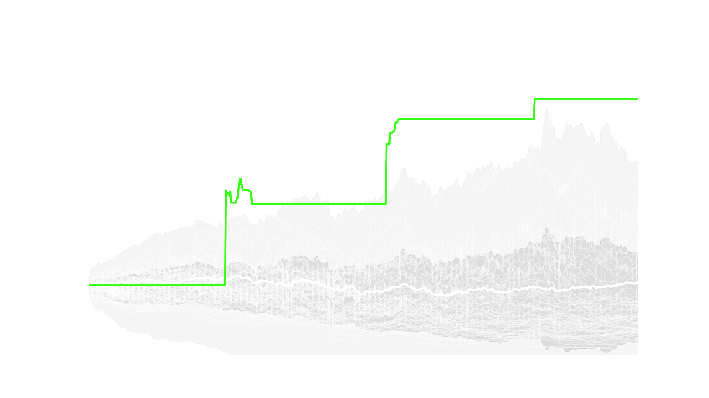

# LSTM AI Stock Predictor

A deep learning pipeline for forecasting short-term stock movements using technical indicators, **Monte Carlo dropout** uncertainty, and **out-of-sample** backtesting.



*Example output: probability-based strategy (neon green), SPY buy-and-hold (white), random baselines (faint white), and ±1σ / ±3σ uncertainty around the random mean (gray). Plots are generated by `run_backtest_v4.py` after forecasts exist in `forecasts/`.*

---

## Overview

This project provides an end-to-end workflow:

- Load and process per-ticker indicator CSVs (`TrainingData/processor.py`, ticker list from `TrainingData/stockList.csv`)
- Train a **Conv1D + LSTM** model with MC dropout in **`run_forecast_v4.ipynb`**
- Write forecasts to **`forecasts/`** and split metadata (`split_info.json`, `oos_start_date.txt`) for aligned backtests
- Run **`run_backtest_v4.py`** to simulate trading on the **test / OOS window only** and export plots to **`videos/`** (and related visuals under **`output_plots/`** from the notebook)

The design emphasizes realistic evaluation (no training dates in the backtest), uncertainty-aware signals, and extension via `TrainingData/featuresPy/`.

## Repository layout

```
├── forecasts/                 # *_forecast.csv outputs + split_info.json / oos_start_date.txt
├── cache/                     # Cached preprocessed arrays
├── output_plots/              # Notebook exports (training curves, feature importance, etc.)
├── videos/                    # Backtest static PNGs and MP4s from run_backtest_v4.py
├── repo_photos/               # Images for this README (commit your PNG here for GitHub)
├── TrainingData/
│   ├── indicators_data/
│   │   ├── raw/               # Raw inputs (e.g. fear_greed, prices)
│   │   └── processed/
│   │       ├── SPY-VIX/       # Benchmark series (e.g. SPY for backtest plot)
│   │       └── stocksData/    # One processed CSV per ticker
│   ├── featuresPy/            # Extra feature modules (e.g. rolling correlations)
│   ├── stockList.csv          # Tickers processed by processor.py
│   ├── processor.py           # Main feature pipeline
│   └── downloader.py          # Optional data download helpers
├── run_forecast_v4.ipynb      # Train / forecast pipeline (primary notebook)
├── run_backtest_v4.py         # OOS backtest + plots / videos
├── requirements.txt
└── README.md
```

## Available features (indicators)

`close`, `YesterdayClose`, `YesterdayOpenLogR`, `YesterdayHighLogR`, `YesterdayLowLogR`, `YesterdayVolumeLogR`, `YesterdayCloseLogR`, `MA10`, `MA20`, `MA30`, `DayOfWeek`, `DayOfMonth`, `MonthNumber`, `EMA10`, `EMA30`, `RSI`, `MACD`, `MACD_Signal`, `BollingerUpper`, `BollingerLower`, `Volatility_10`, `Volatility_20`, `Volatility_30`, `OBV`, `ZScore`, insider and sentiment fields, gap/volatility/momentum features, and others merged in `processor.py` (see code for the full set).

## Key features

| Feature | Description |
|--------|-------------|
| **Conv1D + LSTM** | Captures local patterns and sequence structure in windowed inputs |
| **Monte Carlo dropout** | Uncertainty (std) around probability forecasts |
| **Train / val / test split** | Notebook writes OOS start; backtest uses test period only |
| **Walk-forward–style windows** | Rolling windows over processed history |
| **Batch data generator** | Efficient training from cached tensors |
| **Confidence threshold** | Configurable probability gate for “buy” signals (e.g. in notebook `CONFIG`) |

## Getting started

### 1. Requirements

```bash
pip install -r requirements.txt
```

### 2. Processed data

Place processed stock CSVs under `TrainingData/indicators_data/processed/stocksData/` (or run the optional download + processor steps below). Ensure `TrainingData/stockList.csv` lists the tickers you want.

### 3. Train and forecast

Open and run **`run_forecast_v4.ipynb`** from the project root. It trains the model, writes forecasts under **`forecasts/`**, and can export plots to **`output_plots/`**.

### 4. Backtest (out-of-sample)

The backtest reads **`forecasts/split_info.json`** (or `forecasts/oos_start_date.txt` / env `BACKTEST_OOS_START`) so it only trades on dates **on or after** the OOS start.

```bash
python run_backtest_v4.py
```

Outputs include PNGs and MP4s under **`videos/`** (e.g. `random_vs_prob_strategy_uncertainty.png`).

---

## Optional: build datasets from scratch

### Alpha Vantage API

`TrainingData/downloader.py` can use **Alpha Vantage** for prices. Get a key at [alphavantage.co](https://www.alphavantage.co/support/#api-key), set it in the script, then:

```bash
python TrainingData/downloader.py
```

### Process raw → `stocksData/`

```bash
python TrainingData/processor.py
```

---

## README image

To show the screenshot on GitHub, add your exported file as:

`repo_photos/random_vs_prob_strategy_uncertainty.png`

(e.g. copy from `videos/random_vs_prob_strategy_uncertainty.png` after a successful backtest).
