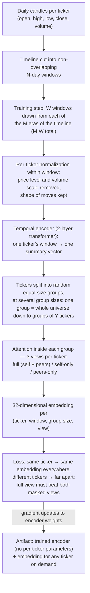
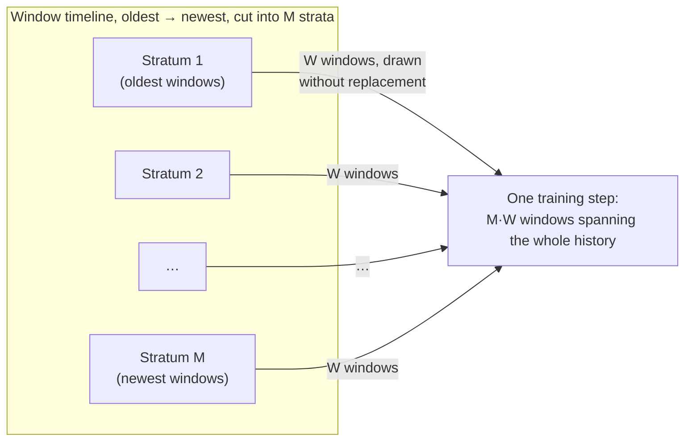
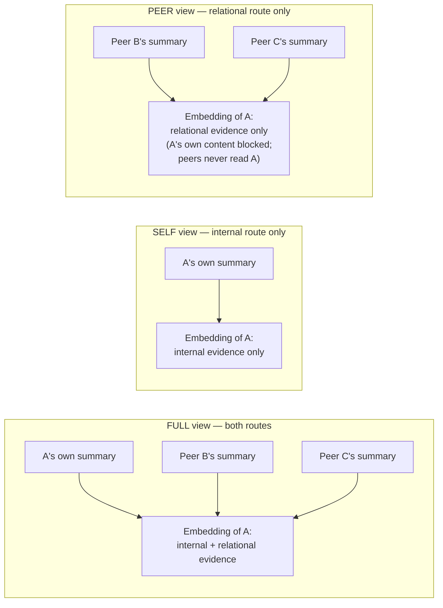
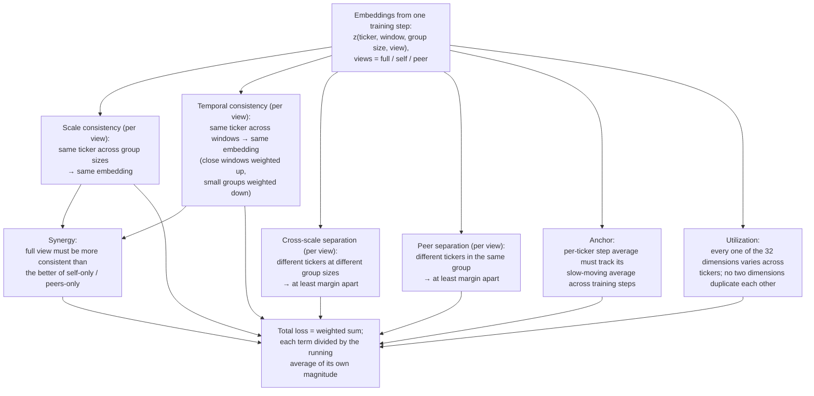

# Stock Identity Encoder — Specification

**Status:** design spec v0.3 — implementation decisions pinned (§11); collapse guards added after run r1 collapsed (§6.8 normalization split, §11.6). Standalone system living in `StockIdentityModel/` at the repo root; does not depend on or modify the v4 forecasting pipeline.

## 1. Goal

Build a model that computes, for any stock, a 32-dimensional vector — its **identity embedding** — from raw daily candles, capturing a quality of the stock that is stable in time and distinguishes it from other stocks.

The embedding must satisfy four properties:

| Property | Meaning |
|---|---|
| **Persistent** | The same ticker gets (nearly) the same vector regardless of which time window, which companion group, which group size, or which dropout draw produced it. |
| **Distinctive** | Different tickers get vectors far apart — within one window, and across windows and group sizes. |
| **Two-route** | The vector must be derivable from the ticker's own price behavior alone *and* from its relations to other tickers alone — and the combined computation must be more reliable than either route by itself. |
| **Inductive** | The model contains no per-ticker parameters. Any ticker with enough candle history plus a set of context tickers can be embedded at inference — including tickers never seen during training. |

The deliverable is a trained encoder (weights + configuration + an `embed()` recipe), not a lookup table. A table of embeddings for the training tickers is produced at export through the same recipe (§8).

> **Structural invariant.** Ticker identity and calendar position never enter the model. Identity is used only for loss bookkeeping and the training-only anchor buffer (§6.6). A window's position on the timeline is used only as a loss weight (κ, §6). This makes the model inductive by construction.

## 2. End-to-end picture



## 3. Vocabulary

| Term | Meaning |
|---|---|
| **window** `w` | `N` consecutive trading days. Windows tile the timeline without overlap. `t_w` = the window's ordinal position. |
| **stratum** | One of `M` contiguous blocks of the window sequence (block 1 = oldest windows, block M = newest). |
| **universe** `U_w` | The tickers with complete candle data inside window `w`. |
| **partition scale** `s` | A choice of how many equal-size groups `U_w` is split into. Scale 1 = one group containing everyone; the finest scale has groups of minimum size `Y`. |
| **group** `g` | One cell of a partition: the set of tickers a given ticker attends over. |
| **observer** | The ticker whose embedding is currently being computed. |
| **view** `v` | Which evidence the observer may use: `full` (itself + peers), `self` (itself only), `peer` (peers only). |
| **embedding** `z` | The 32-dimensional output vector, indexed `z(ticker, window, scale, view)`. |
| **observer dropout** | Training-only random masking of which peers an observer sees. Identical across one observer's three views, different between observers. |
| **anchor** `a_i` | A slow-moving per-ticker average of embeddings, maintained only during training (§6.6). |

## 4. Data layer

### 4.1 Windows

Tile the timeline into non-overlapping windows of `N` trading days. A ticker belongs to `U_w` only if all `N` days are present. The window index `t_w` is recorded for loss weighting and is never fed to the model — a model that can see calendar position can fingerprint eras, which contradicts persistence.

**Training tiling offset.** During training the whole tiling is shifted back by one random offset `δ ∈ [0, N)` per sampler epoch (one full without-replacement pass over the windows): window `k` covers `[base_k − δ, base_k − δ + N)`, underflow at the old end falls back to the base span. One `δ` per epoch keeps every within-step comparison on a single coherent tiling. Rationale (run r3 post-mortem): with the fixed tiling there are only ~104 × #tickers distinct input tensors, each shown ~1500 times over a training run — enough repetition to memorize specific window textures instead of learning identity; offsets make the exact-input repeat count ~1 while every span remains authentic market data. Evaluation, export, and inference always use the base (`δ = 0`) tiling.

### 4.2 Step sampling

Split the window sequence into `M` contiguous strata. Each training step draws **`W` windows per stratum** (`M·W` windows total), so every step compares a ticker against itself across the full span of history.



Draws are without replacement: each stratum keeps a shuffled queue; when any queue cannot serve `W` draws, **all queues refill and reshuffle together** (at most one leftover window per stratum is discarded), which defines the epoch boundary at which the tiling offset δ (§4.1) is redrawn. Consequences: no window is reused before (almost) all others in its stratum have been used, and the whole timeline cycles simultaneously under a single tiling per epoch. With `W > 1`, some of a step's window pairs come from the same era; the proximity weight κ (§6) already weights close pairs, so no special handling is needed.

`W = 2` (the default) also serves eligibility: with `W = 1`, a ticker whose entire history sits inside one stratum can appear in at most one of a step's windows and therefore never enters temporal consistency (§4.4, §6.3). Two draws per stratum make within-stratum pairs possible, so short-history tickers receive the persistence signal too.

### 4.3 Grouping

On each visit to a window, for each scale `s` in the ladder `𝒢`, draw a **fresh uniformly random partition** of `U_w` into `n_s` groups of equal size (±1), every group at least `Y` tickers.

- Ladder: geometric — `n_s ∈ {1, 2, 4, 8, …}`, capped so the smallest group still has `Y` tickers. Doubling steps span the whole range from one universe-wide group down to `Y`-sized groups; consecutive integer counts would add near-identical contexts at full cost.
- Partition randomness is seeded by `(window id, visit counter)`. With hundreds of tickers the number of possible partitions is astronomically large, so fresh seeded draws never repeat a grouping in practice — no bookkeeping needed.

### 4.4 Eligibility

A ticker enters a loss term only when the data that term needs exists (e.g., temporal consistency needs the ticker present in at least 2 of the step's windows). Ineligible tickers still participate fully as attention context for others.

## 5. Model

### 5.1 Candle normalization

Per ticker, per window, day `t` becomes five features:

```
( log O_t/C_{t−1},  log H_t/C_{t−1},  log L_t/C_{t−1},  log C_t/C_{t−1},  log V_t/median_w(V) )
```

`O, H, L, C, V` = open, high, low, close, volume. The first day uses its own open as the base. Optionally clip log-returns at quantile `q_clip` to absorb splits and halts.

This removes the two cheap identity fingerprints — absolute price level and absolute volume — while keeping what is legitimately the stock's own behavior: shape of moves, gaps, daily ranges, relative volume dynamics.

### 5.2 Temporal encoder

A 2-layer transformer of width `d_model` with `n_h` attention heads reads one ticker's normalized window — one token per day, positional information = day index **within the window** only — and a learned summary token collects the result. Output: one summary vector `h_i` per ticker per window.

This stage is strictly per-ticker. All cross-ticker information flows through §5.3.

### 5.3 Context module — three views

*Attention, as used here: each ticker forms a weighted average of other tickers' vectors, with learned weights reflecting relevance. The weights are normalized to sum to 1, so groups of any size aggregate the same way, and no ordering information is attached to tickers, so the result does not depend on how the group is listed.*

`L_ctx` attention blocks run over a group's summary vectors. Each block computes attention, then a small per-ticker feed-forward layer, and adds its input back to its output (a **residual connection** — this detail matters below). For every observer, the same weights produce three views:



- **full** — the observer attends itself and all peers. One pass serves the whole group.
- **self** — attention restricted to each ticker itself; the block reduces to a per-ticker transformation under the same weights. One pass serves the whole group. Using identical weights with withheld context is the point: differences between views are attributable to the withheld evidence, not to different functions.
- **peer** — the observer reads peers, peers never read the observer, and the observer's entry residual is cut. Two leaks force this construction:
  1. The residual connection would carry the observer's own content into the output even with self-attention masked — so the observer's entry residual is severed.
  2. In any block after the first, peers' vectors would already contain the observer's content (absorbed when they read the observer in block 1) and would reflect it back — so peers must never read the observer at all.

  With both leaks closed, the observer's own content reaches the output only as it is genuinely mirrored in how peers behave — exactly the relational signal this view isolates.

  Cost: the exact peer view needs one pass per observer (`g` passes for a group of size `g`). Groups up to `g_exact` use the exact computation; larger groups use a shared-context approximation (peers' vectors computed once with everyone present). The approximation's residual leak shrinks as `1/g`, confining it to exactly the regime where it is negligible.

A final linear layer maps `d_model → D = 32`. The embedding space is not normalized to unit length; its scale is set by the utilization term (§6.7).

### 5.4 Observer dropout

*Dropout: randomly disabling parts of a computation during training so the model cannot rely on any single pathway. Here it is applied at the attention level, and only during training — inference is fully deterministic.*

Per (observer, window, scale): draw one random mask over **which peers the observer may see** this step, and reuse the identical mask across the observer's three views — so view differences are never dropout noise. Masks are independent across observers: every ticker sees its own randomly thinned version of the group, so a group's exact composition can never be memorized as a lookup key. Standard dropout at rate `p_ff` applies inside feed-forward layers. One draw per observer per step.

Intentional side effect: the self view does not depend on the group at all, so across scales it varies only through dropout draws. Scale consistency applied to the self view (§6.1) therefore directly penalizes dropout sensitivity — embeddings must rest on qualities robust to deletion of random evidence.

## 6. Loss

All terms are computed from one training step's embeddings.



**Notation.** `z_i^{w,s,v}` — embedding of ticker `i` in window `w` at scale `s` under view `v`. `μ_i^{s,v}` — mean of `z_i` over the step's windows containing `i`, at scale `s`, view `v`. `Var{…}` — variance per dimension, summed over the `D` dimensions (equivalently, mean squared distance to the mean). `d(x,y)` — Euclidean distance. `sg(·)` — stop-gradient: the value is treated as a constant when computing training updates. `ε` — small constant preventing division by zero.

Two reusable weights:

- **Proximity** `κ(Δ) = 1 + α_prox · exp(−Δ/τ_prox)`, where `Δ` is the distance between two windows in window-index units. Windows close in time *must* agree (boosted penalty); windows far apart may carry legitimate slow drift (baseline weight 1, never zero).
- **Context trust** `ω(g) = (g−1)/(g−1+c_g)`, rising toward 1 with group size `g`. A ticker seen with only `Y−1` random peers has a noisy context; fluctuation there is partly sampling noise, so thin contexts get less vote. `c_g` = group size at which trust reaches ½.

### 6.1 Scale consistency `L_sc(v)`

```
L_sc(v) = Σ_i  Var over s of  μ_i^{s,v}
```

A ticker's window-averaged embedding must not depend on how many tickers it was grouped with.

### 6.2 Cross-scale separation `L_xsep(v)`

Pairs: ticker `i` at scale `s` against every other ticker `j ≠ i` at every other scale `s' ≠ s`.

```
L_xsep(v) = mean over pairs of  max(0, m_sep − d(μ_i^{s,v}, μ_j^{s',v}))²
```

Different tickers must sit at least `m_sep` apart even when embedded under different group sizes. The penalty is zero once the margin is met — separation has a finish line, so this term cannot push the space apart indefinitely or fight the anchor and utilization terms at equilibrium.

### 6.3 Temporal consistency `L_tc(v)` — the core persistence demand

```
L_tc(v) = Σ_i Σ_s  ω(g_s) · [ Σ_{w<w'} κ(Δ_ww') · d(z_i^{w,s,v}, z_i^{w',s,v})² ]  /  [ Σ_{w<w'} κ(Δ_ww') ]
```

Same ticker, different eras → same embedding. Near-window pairs are weighted up by κ; thin-context scales are weighted down by ω. (With κ and ω constant this equals exactly twice the across-window variance; the pairwise form exists so κ can attach to window pairs.)

### 6.4 Peer separation `L_psep(v)`

Within each group, at each (window, scale):

```
L_psep(v) = mean over (w,s), observers i, peers j of  max(0, m_sep − d(z_i^{w,s,v}, z_j^{w,s,v}))²
```

In any single window, in any group, a ticker must not blend into its peers.

**Coverage.** 6.4 separates tickers within a window at one scale — and at scale 1 the "group" is the whole universe, so same-window global separation is included. 6.2 separates across scales. 6.1 + 6.3 collapse each ticker's set of embeddings toward a single point. Jointly: one tight point per ticker, all points at least `m_sep` apart, stable across time, scale, grouping, and dropout. Cross-window separation between *different* tickers follows from 6.3 + 6.4 combined and needs no term of its own.

**Per-view application.** Terms 6.1–6.4 are computed for each of the three views, and the views are themselves weighted:

```
L_bundle(v) = λ_sc·L_sc(v) + λ_xsep·L_xsep(v) + λ_tc·L_tc(v) + λ_psep·L_psep(v)
```

### 6.5 Synergy `L_syn`

Per-view inconsistency: `I_v = L_sc(v) + L_tc(v)` (the two consistency terms only). Precision: `P_v = 1/(I_v + ε)`.

```
L_syn = (P_self + P_peer) / (P_full + ε)
      = 2·(I_full + ε) / HM(I_self + ε, I_peer + ε)        HM(a,b) = 2ab/(a+b), the harmonic mean
```

The full view's inconsistency must be small relative to the harmonic mean of the masked views' inconsistencies. The harmonic mean hugs the smaller of its two inputs, so the bar automatically tracks whichever masked route is currently stronger. The ratio scales smoothly with how much better the full view is (no hard threshold), and multiplying all inconsistencies by a constant changes nothing — the term stays calibrated as losses shrink over training.

The term can fall by improving the full view or by degrading the masked views; degradation is taxed by 6.1/6.3 applied to those views. This tension is intentional: training updates flow through numerator and denominator both, and the equilibrium is set by `λ_syn` against the masked views' bundle weights. The masked inconsistencies are deliberately **not** wrapped in `sg(·)`: with the denominator frozen, the term's gradient becomes a positive scalar times the gradient of `I_full` — extra weight on full-view consistency, a direction the full view's own bundle already supplies — and the coupling that forces the full view to outperform both routes disappears. If `I_self` or `I_peer` climbs during training, the correction is numerical (raise `λ_self`/`λ_peer` or lower `λ_syn`), not structural.

### 6.6 Anchor `L_anc`

One buffer `a_i ∈ ℝ^D` per training ticker — training-only state, never used at inference. Per step, in this order:

```
z̄_i  = mean over (w,s) of z_i^{w,s,full}          # the step's estimate; tracks the deployment view (full)
Δ_i  = (1/D) · ‖z̄_i − a_i‖₁                       # mean absolute difference to the anchor BEFORE update; sg(a_i)
η_i  = η₀ · exp(−I_i / τ_gain)                     # I_i = ticker i's own full-view inconsistency this step
a_i  ← (1 − η_i)·a_i + η_i·sg(z̄_i)                # exponential-moving-average update, AFTER Δ_i is taken
L_anc = mean over eligible i of Δ_i
```

The gain rule: when the model is currently consistent about ticker `i`, the fresh estimate is trustworthy and moves the anchor faster; when inconsistent, the anchor barely moves. Each ticker's representation settles into a fixed value across training, while that value keeps tracking current good estimates instead of freezing on stale history. The anchors are training state only; the embedding table shipped with the artifact is recomputed at export (§8).

### 6.7 Utilization `L_util`

Over the step's population `{z̄_i}` — one point per eligible ticker, where `z̄_i` is the step's full-view mean over (w, s) exactly as defined in §6.6: let `v_d` = variance of dimension `d` across tickers, and `ĉ` = the D×D correlation matrix across tickers. (Pooled, not per-scale: a per-scale population would let a ticker's own across-scale scatter — the thing `L_sc` is driving to zero — count toward the variance floor, so the floor could be met in a fully collapsed state. One point per ticker makes the floor measure pure between-ticker spread, which is the collapse this backstop exists to outlaw.)

```
L_var  = (1/D) · Σ_d  max(0, √v₀ − √(v_d + ε))²        # every dimension must vary across tickers by at least v₀
L_cov  = mean over d ≠ d' of  ĉ_{dd'}²                  # no dimension may duplicate another
L_util = L_var + λ_cov · L_cov
```

This is also the anti-collapse backstop: the cheapest global solution to the consistency terms is "every ticker the same constant vector". The variance floor outlaws that per dimension, and decorrelation makes 32 dimensions mean 32 distinct degrees of freedom rather than one signal copied 32 times.

### 6.8 Total

```
L = Σ_v λ_v · L_bundle(v)  +  λ_syn·L_syn  +  λ_anc·L_anc  +  λ_util·L_util
```

Before weighting, each term is normalized — by **two different rules**:

- **Fixed-scale terms** (`L_xsep`, `L_psep`, `L_util`, `L_anc`) are divided by constants: `m_sep²` for the separation hinges, `v₀ + λ_cov` for utilization (their ceilings), and `√v₀` — the geometry unit — for the anchor. Their gradients keep a constant scale regardless of the term's current value. The anchor is here because it is ℓ1: an ℓ1 gradient's norm is independent of the residual, so EMA self-normalization turns it into a contraction ratchet whose force grows as `1/L_anc` as the anchors converge (run r2: it became the dominant force in the system).
- **EMA-normalized terms** (`L_sc`, `L_tc`, `L_syn` — quadratics, whose gradient vanishes with the term, plus the scale-invariant ratio) are divided by a frozen running average of their own magnitude, floored: `L̂_k = L_k / sg(max(EMA_β[L_k], κ_floor·L_k⁽¹⁾) + ε)`, where `L_k⁽¹⁾` is the term's first-step value. The λ's stay relative priorities as raw magnitudes drift, but a term approaching zero can amplify its own gradient at most `1/κ_floor`.

*Why the split (post-mortem of run r1, which collapsed totally).* Normalizing every term by its own EMA equalizes **values** — everything reads ≈ 1 — but not **gradients**. A quadratic consistency term's normalized gradient grows as `1/√L` as it shrinks, while a saturated hinge's stays constant; total collapse (every ticker at one point, separations pinned at their ceiling, utilization at maximum violation) is then a *stable attractor*: the better consistency gets, the harder it pulls, and the §6.7 backstop is outgunned without bound. The fixed hinge scales remove the saturation blindness; the floor turns the `1/√L` runaway into a force that *vanishes* at collapse (constant denominator ⇒ gradient ∝ √L); init calibration (§11.6) starts the geometry feasible so the contest never begins.

Principal tuning knob: `λ_syn` (sets the masked↔full equilibrium). The geometry's scale is set jointly by `m_sep` and `v₀`.

## 7. Training step

```
windows = [stratum_queue[k].pop() for k in 1..M, W draws each]   # refill + reshuffle a queue only when empty
for w in windows:
    U_w  = tickers complete in w
    H[w] = temporal_encoder(normalize(candles(w)))         # one summary vector per ticker
    for s in ladder(|U_w|):                                # n_s groups, each ≥ Y tickers
        P[w,s] = fresh_partition(U_w, n_s, seed=(w.id, visit_counter[w]))
        for g in P[w,s]:
            draw per-observer dropout masks for g
            z[·,w,s,full] = context_module(H[w][g], view=full)   # one pass for the group
            z[·,w,s,self] = context_module(H[w][g], view=self)   # one pass for the group
            z[·,w,s,peer] = context_module(H[w][g], view=peer)   # one pass per observer (exact ≤ g_exact)
            # all three passes reuse each observer's dropout masks
compute terms 6.1–6.5 and 6.7 over eligible tickers
compute z̄_i; compute Δ_i; update anchors; add 6.6
L = normalized weighted sum  →  backpropagate  →  optimizer step
```

Sizing for this repo's data (~348 tickers, ~25 years of daily candles ≈ 98 windows at `N = 64`): `M·W = 8` windows per step (`M = 4`, `W = 2`), 6-scale geometric ladder. Full and self views cost one pass per (window, scale). The only heavy item is the exact peer view at the universe scale (348 passes over 348 tickers) — feasible on GPU, and capped by `g_exact` if needed. The anchor buffer is 348 × 32 floats — negligible.

## 8. Inference and artifact

Inference is deterministic — no dropout.

```
embed(target_candles, context_candles, windows):
    for each window: normalize → temporal encoder → full view,
        single-group scale, context = training universe present in that window
    return the average embedding over the last K_inf windows
```

Averaging over windows is residual-noise reduction, not correction — training already forces agreement across windows, groupings, and scales.

Because the embedding is relational by design, **inference requires contemporaneous candles for the context tickers**. The artifact therefore bundles:

1. Encoder weights + configuration (`N`, `D`, ladder, normalization spec, universe ticker list).
2. A context-fetch recipe (which tickers, which date ranges).
3. A canonical embedding table for the training universe, recomputed at export through the inference recipe above (last `K_inf` windows). Recomputed rather than copied from the anchors: the inference path is deterministic and identical to how unseen tickers are embedded, so training tickers and new tickers land in directly comparable coordinates.

**Acceptance test** — the number this system stands on:

1. Hold out `k` tickers entirely from training.
2. After training, embed them across many windows.
3. Check that (a) their across-window consistency matches the trained tickers' — persistence transfers to unseen tickers; and (b) given embeddings from one set of windows, each held-out ticker's embedding from a *different* set of windows finds itself as nearest neighbor — distinctiveness transfers.

Training loss going down does not certify the goal; this test does. (Holdout selection and eval cadence are pinned in §11.)

## 9. Hyperparameters

| Symbol | Meaning | Default |
|---|---|---|
| `N` | window length, trading days | 64 |
| `M` | number of strata | 4 |
| `W` | windows drawn per stratum per step | 2 |
| `Y` | minimum group size | 8 |
| `D` | embedding dimension | 32 |
| — | temporal encoder depth | 2 layers |
| `d_model`, `n_h` | encoder width, attention heads | 128, 4 |
| `L_ctx` | context module depth | 2 blocks |
| `𝒢` | scale ladder | geometric {1, 2, 4, …}, smallest group ≥ Y |
| `p_attn` | observer dropout rate | 0.15 |
| `p_ff` | feed-forward dropout rate | 0.10 |
| `α_prox`, `τ_prox` | proximity boost and its decay length | 1.0, (#windows)/10 |
| `c_g` | context half-trust group size | 16 |
| `m_sep` | separation margin | √D/2 ≈ 2.8 (with v₀ = 1) |
| `v₀` | per-dimension variance floor | 1.0 |
| `λ_cov` | decorrelation weight inside L_util | 1.0 |
| `η₀`, `τ_gain` | anchor base gain, gain temperature | 0.05, running mean of I_i |
| `β` | decay of the running-magnitude averages (§6.8) | 0.99 |
| `κ_floor` | EMA-denominator floor, as a fraction of the term's first-step value (§6.8) | 0.01 |
| `ε` | numerical safety constant | 1e−6 |
| `λ_full / λ_self / λ_peer` | view weights | 1.0 / 0.5 / 0.5 |
| `λ_sc, λ_tc, λ_xsep, λ_psep, λ_anc` | term priorities | 1.0 each |
| `λ_util` | utilization priority — raised after r3's dimensional concentration (median dim variance ~1e−4 vs `v₀ = 1`) | 3.0 |
| `window_offset` | per-epoch training tiling offset (§4.1) | on |
| `λ_syn` | synergy priority — principal knob | 0.3 |
| `g_exact` | exact peer-view threshold | 64 |
| `q_clip` | log-return clipping quantile | 0.999 |
| `K_inf` | windows averaged at inference | 4 |
| — | dropout draws per observer per step | 1 |

## 10. Instrumentation

Log from day one — tuning decisions are made against these, not against intuition:

- Per-term magnitudes, raw and normalized.
- Per-term effective gradient force on the step's embeddings, `λ_k·‖∂L_k/∂z‖/denom_k`, plus the normalizer denominators (cadence `grad_diag_every`). Values alone hide collapse — the r1 failure was invisible in normalized terms (all ≈ 1) and obvious in forces; the contraction (sc/tc/anc) vs expansion (xsep/psep/util) balance must be read in gradient units.
- `I_full`, `I_self`, `I_peer` trajectories (synergy health; guides `λ_syn` and the masked-view weights, §6.5).
- Per-dimension variance spectrum of `{μ_i}` (collapse watch), and mean/min pairwise distance of the step's `{z̄_i}` population every step.
- Anchor drift distribution `‖z̄_i − a_i‖`.
- Agreement between embeddings of the same ticker under re-drawn partitions at a fixed window.
- Held-out-ticker retrieval accuracy (§8) — the acceptance metric.

## 11. Implementation decisions

Settled choices for the build; the design above is unchanged by anything here.

### 11.1 Location, framework, data source

- Code lives in **`StockIdentityModel/`** at the repo root. PyTorch.
- Candle source: **raw OHLCV from `TrainingData/indicators_data/raw/`**. The processed CSVs cannot serve as input — Stage 2 (`processor.py`) drops the raw `open/high/low/volume` columns this model needs.
- No other touchpoint with the v4 pipeline.

### 11.2 Optimizer & schedule

AdamW (`β₁ = 0.9`, `β₂ = 0.98`, `ε = 1e−8`), peak LR `3e−4`, linear warmup 500–1000 steps, cosine decay to `1e−5`, global-norm gradient clip `1.0` (the synergy ratio, the squared hinges, and the ℓ1 anchor loss can all spike transiently). Weight decay `0.01`, excluding biases, LayerNorm parameters, and the final `d_model → D` projection — decay on that projection pushes against the variance floor `v₀` for no benefit. The warmup window deliberately overlaps the §6.8 normalizer burn-in, during which effective term weights are still mis-scaled. Anchor buffers `a_i` are not optimizer parameters; they update only through their §6.6 EMA rule.

### 11.3 Holdout protocol (concretizes §8)

- Pool = tickers with complete data across the full window span (survivors present from the beginning). Hold out **5% of that pool**, drawn uniformly with a fixed seed; the list is frozen into the artifact configuration. Log the pool size; if the pool is small (< ~100), floor the holdout at ~10 tickers so the retrieval statistic isn't anemic.
- Exclusion is **total**: held-out tickers appear in no `U_w` — neither as observers nor as attention context. They first touch the model at acceptance time, embedded exactly as an unseen ticker would be.
- Retrieval gallery = held-out embeddings ∪ the canonical training table (training tickers serve as distractors; a holdout-only gallery would be trivially easy).
- Scope: this certifies induction onto long-history survivor-class tickers. Transfer to short-history names is not measured by this holdout.

### 11.4 Training length & checkpoint selection

No fixed step budget; the operator picks the checkpoint from the training graphs.

- **Every step (free, already computed in the loss):** all §10 scalar series. Note the §6.8 normalization holds normalized terms near 1 by construction — the *raw* magnitudes are the convergence curves.
- **Every ~200–500 steps:** run the held-out §8 consistency + retrieval protocol and the partition-redraw agreement check, and write a checkpoint — so every checkpoint carries its acceptance numbers. The deciding curve for checkpoint selection is the held-out metric, per §8's own doctrine that training loss certifies nothing.
- **Selection metric** (`best_metric`): default = held-out retrieval accuracy (the acceptance metric). Optional `consistency` mode selects on the held-out consistency median computed over `cons_eval_windows` (32) windows spread across the sampler's M strata — the full timeline, mirroring how training samples windows — rather than the newest 16. Use it when retrieval's 10-trial granularity (±0.1 steps, std ≈ ±0.13) makes selection too noisy. Caveat: consistency is scale-dependent and collapse-blind; the retrieval column remains the acceptance read.
- **Checkpoints store full training state**: weights, optimizer state, §6.8 EMA normalizers, anchors, stratum queue positions, visit counters, RNG state. Visit counters are load-bearing — partition seeds are `(window id, visit counter)` (§4.3). Selection reads weights only; the shipped table is recomputed at export (§8).

### 11.5 Pinned defaults

Resolutions of details the design leaves open; two implementations following this list produce the same function.

| Area | Decision |
|---|---|
| Window tiling | Anchored at the **newest** day, tiling backward; partial leftover at the oldest end discarded. Inference and the export table use the last `K_inf` windows, which must end at the latest data. |
| Calendar | Global trading-day grid (union of ticker dates / benchmark calendar). A ticker is in `U_w` iff it has a bar on every grid day of the window. |
| Zero/missing volume | Makes the window incomplete for that ticker (`log V/median` is undefined at `V = 0`). |
| `q_clip` | Global, symmetric thresholds (quantiles `q` and `1−q` of all training-period log-returns), computed once, frozen, shipped in the normalization spec. |
| Strata | Equal window counts (±1). |
| Transformer details | Pre-norm blocks; learned positional embedding over day slots; the summary token carries no position; the context module reuses `d_model`, `n_h`. |
| Peer view residual | "Entry residual is cut" = **block 1 only**; block 2's observer input is already a pure peer aggregate, so its residual is clean. |
| Peer view query | The observer's own summary still forms the attention **query** over peers — weights may depend on the observer, values never contain it. That is the relational route working as intended. |
| Observer dropout edge | If a draw leaves an observer zero visible peers, redraw the mask. |
| Shared-context approximation | One masked everyone-attends-everyone pass produces all tickers' block outputs; the observer's rows are recomputed with self masked and the block-1 residual cut, reusing peers' vectors from the shared pass. |
| `I_i` (per-ticker, §6.6) | Ticker `i`'s own summands of `L_sc(full) + L_tc(full)` this step. |
| EMA normalizers | Initialize to the term's first-step value (step 1 normalizes to exactly 1); update *after* the normalized loss is computed, using the previous step's EMA. |
| Anchor init | `a_i` ← the ticker's first `z̄_i`; `Δ_i` enters `L_anc` from the ticker's second eligible step. `τ_gain` uses the same `β` as §6.8. |
| Statistics | Population variances throughout; `L_psep` averages over ordered (observer, peer) pairs. |
| `embed()` | Returns only the target's row; peers' perturbed vectors from the joint pass are discarded. |

### 11.6 Collapse guards (post-r1)

Run r1 (first full training) collapsed totally by ~step 800: every readout matched the degenerate closed forms (`L_psep → m_sep² = 8`, `L_util → (√v₀−√ε)² = 0.998001`, per-dim variance ~1e−9, held-out retrieval 0/10 flat). Mechanism in §6.8. Guards, all in code:

- **Normalization split + floor** — §6.8's two rules. `κ_floor = 0.01` caps any EMA-normalized term's gradient self-amplification at 100× its step-1 calibration. The anchor was moved to the fixed-scale rule after run r2: its ℓ1 gradient does not shrink with its value, so even the floored EMA path let its force climb ~13× and grind the population to ~10⁻⁴ of the variance floor (scale contraction plus dimensional collapse — variance concentrated in a handful of the 32 dims) while the fences pushed back at bounded strength.
- **Init calibration** (`calibrate_init`, fresh runs only) — before the optimizer is built, rescale the final `d_model → D` projection per dimension so the population variance of `z̄` — measured through the inference geometry (full view, single group, last `K_inf` windows) — starts at `v₀`. Hinges begin satisfied and act as fences; uncalibrated init sits ~2–4 orders of magnitude inside the violation region (r1: per-dim var 1e−4…7e−3 vs `v₀ = 1`) and the contraction wins the opening race.
- **Force diagnostics** (`grad_diag_every`, default 250) — the train log records per-term `λ_k·‖∂L_k/∂z‖/denom_k` (`force`) and the live denominators (`denom`); every step records mean/min pairwise distance of the `z̄` population (`zbar_dist`). The acceptance doctrine extends: term values certify nothing about force balance — read the forces.
