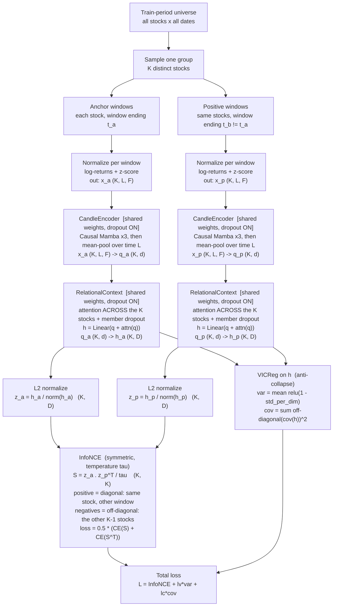
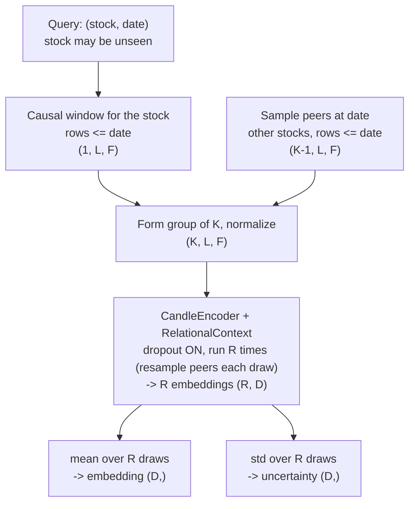

# Stock Identity Encoder

Learns an **inductive, time-stable, relational** embedding per stock per date. The embedding is a function of price dynamics only — no ticker IDs, no per-ticker parameters — so unseen stocks embed for free. Training forces the same stock's embedding to persist across time windows *and* across random peer draws; the surviving invariant is the stock's persistent position relative to the market. That invariant is the "value."

Downstream use: replace arbitrary per-ticker embeddings/enums in the predictor with this content-derived vector. Adding stocks then requires no architecture change.

## Target properties → mechanism

| Property | Mechanism |
|---|---|
| Inductive (new stock, zero new params) | embedding = `f(candles, peers)`; weights shared across all stocks |
| Identity-free | no ticker ID input; per-window normalization removes absolute price level |
| Time-stable | positive pair = same stock, two different windows → InfoNCE pulls them together |
| Relational | per-stock query is contextualized by cross-attention over its group (real peers) |
| Non-collapsing | InfoNCE negatives + VICReg variance/covariance terms |
| Causal (no leakage) | causal Mamba; window uses rows ≤ t; peers contemporaneous; train-period-only fit |
| Grounded, not shortcut | member dropout + per-step regrouping defeat closed-set elimination |

## Architecture



Both branches are the same network with one shared set of weights (Siamese); they differ only in which window of each stock they consume. `K`=group size, `L`=window length, `F`=feature count, `d`=encoder width, `D`=embedding width.

## Blocks

| Block | In → Out | Notes |
|---|---|---|
| `WindowNormalizer` | `(K,L,F_raw)` → `(K,L,F)` | deterministic; log-returns + per-window z-score; drops absolute price level |
| `CandleEncoder` | `(K,L,F)` → `(K,d)` | causal Mamba ×3 → masked mean-pool; shared, Siamese; dropout ON |
| `RelationalContext` | `(K,d)` → `(K,D)` | set cross-attention over the group + residual + linear head; permutation-invariant; member-key dropout; dropout ON |
| L2 normalize | `(K,D)` → `(K,D)` | only for the InfoNCE space (`z`); VICReg terms read pre-norm `h` |

`d` = encoder hidden width. `D` = embedding width. `K` = group size. `L` = window length. `F` = stationary, per-window-normalized features (returns, ranges, volume z-score, scaled indicators); absolute price/level excluded.

## Forward + loss

```python
class CandleEncoder(nn.Module):                # shared across stocks and both views
    def forward(self, x):                      # x: (K, L, F)
        h = self.mamba_stack(x)                # (K, L, d), causal
        return masked_mean(h, dim=1)           # (K, d)

class RelationalContext(nn.Module):            # operates on the whole group at once
    def forward(self, q):                      # q: (K, d)
        mask = member_dropout_mask(q.size(0))  # randomly drop peer keys each pass
        a = self.attn(q, q, q, key_padding_mask=mask)   # (K, d), perm-invariant
        return self.head(q + a)                # (K, D) = h

def objective(h_a, h_p, tau, lv, lc):
    z_a, z_p = F.normalize(h_a, dim=-1), F.normalize(h_p, dim=-1)
    S = (z_a @ z_p.T) / tau                     # (K, K)
    labels = torch.arange(S.size(0))
    info = 0.5 * (ce(S, labels) + ce(S.T, labels))   # symmetric InfoNCE
    var  = vic_variance(h_a)   + vic_variance(h_p)    # hinge: relu(1 - std)
    cov  = vic_covariance(h_a) + vic_covariance(h_p)  # off-diagonal cov squared
    return info + lv * var + lc * cov
```

```python
# VICReg terms (operate on pre-normalization h, batch dim = K)
def vic_variance(h, eps=1e-4):
    std = torch.sqrt(h.var(dim=0) + eps)        # (D,)
    return torch.relu(1.0 - std).mean()

def vic_covariance(h):
    h = h - h.mean(dim=0, keepdim=True)
    cov = (h.T @ h) / (h.size(0) - 1)           # (D, D)
    off = cov - torch.diag(torch.diag(cov))
    return off.pow(2).sum() / h.size(1)
```

One term, three jobs: **InfoNCE** does discrimination (the closed-set "classify within group"), temporal consistency (positive = same stock, other window), and collapse resistance (negatives = the other K−1 stocks). **var/cov** are the seatbelt if negatives go weak.

## Training step

```python
for step in range(num_steps):
    group       = sample_distinct_stocks(K)           # regroup EVERY step
    x_a, x_p    = sample_two_windows(group)           # causal, train-period only
    q_a, q_p    = enc(norm(x_a)), enc(norm(x_p))      # shared weights
    h_a, h_p    = rel(q_a), rel(q_p)                  # shared, group-wise
    loss        = objective(h_a, h_p, tau, lv, lc)
    loss.backward(); opt.step(); opt.zero_grad()
```

- **Distinct stocks per group** → no false negatives in the InfoNCE denominator.
- **Regroup every step** → the closed set is non-stationary; values learned by elimination in one group are wrong in the next; only grounded values survive.
- Optional: bound or weight `|t_a − t_b|` so near windows count more (respects nonstationarity).

## Anti-shortcut defenses

| Shortcut | Defense |
|---|---|
| Closed-set elimination (place K−1 → K-th is free) within a step | member-key dropout in `RelationalContext` |
| Same elimination exploited across steps | per-step regrouping (set composition changes) |
| Absolute price level as near-constant identity | per-window normalization (returns + z-score) |
| Representation collapse to a constant | InfoNCE negatives + VICReg variance term |
| Dimension redundancy | VICReg covariance term |

Dropout is triple-duty: stochastic view generation, MC uncertainty at inference, and the within-step anti-elimination force above.

## Inference / deploy / add-stocks



```python
@torch.no_grad()
def embed(stock, date, R=25):
    w = causal_window(stock, date)                       # rows <= date
    draws = [rel(enc(norm(stack(w, peer_sample(date)))))[0]   # dropout ON
             for _ in range(R)]
    z = torch.stack(draws)
    return z.mean(0), z.std(0)                            # value, uncertainty
```

New ticker → run it; zero new params (zero-shot). Averaging `R` draws marginalizes both dropout noise and peer-draw noise. On distribution shift, fine-tune the encoder ("post-train").

## Hyperparameters

| Symbol | Value | Meaning |
|---|---|---|
| `L` | 61 | window length (window_size+1 convention) |
| `F` | ~20–41 | normalized feature count |
| `d` | 128 | encoder hidden width |
| Mamba blocks | 3 | `d_state=16`, `d_conv=4` |
| `D` | 64 | embedding width |
| `K` | 32–64 | group size (negatives = K−1) |
| `R` | 25 | inference draws |
| `tau` | 0.1 | InfoNCE temperature |
| `lv`, `lc` | 1.0, 0.04 | variance / covariance weights |

## Repo integration (new Stage 2.5, file-contract-chained)

| Contract file | Writer | Reader | Must agree on |
|---|---|---|---|
| `embeddings/{TICKER}_embed.csv` | Stage 2.5 (this) | predictor merge step | columns `Date, emb_0 … emb_{D-1}`; causal (`Date` row uses data ≤ Date); `D` |

- Reads `TrainingData/.../processed/stocksData/{TICKER}_daily_processed.csv`.
- Predictor left-merges `emb_*` on `date`. Feature list is negatively defined → `emb_*` become features automatically. **Do not** add them to `EXCLUDED_COLS`. Requires one predictor retrain.
- PyTorch stage; decoupled from the TF stages purely by the CSV contract.

## Ablation (settle empirically)

Fixed data, split, loss. Vary one axis at a time:

1. **solo** (`z = head(q)`, drop `RelationalContext`) vs **peer-context** — tests whether relation-in-encoder beats relation-in-loss-only.
2. **regroup on/off**, **member-dropout on/off** — tests the anti-elimination claims.

Metrics: OOS within-stock vs across-stock cosine separation; embedding stability across time; downstream predictor lift with `emb_*` as features.

## Open risks

- Existence of a persistent cross-window invariant is the core hypothesis; weak persistence starves both solo and peer-context variants.
- Stacked attention + InfoNCE + consistency can be optimization-unstable; watch for collapse despite VICReg (monitor per-dim std).
- Peer-draw variance at inference; mitigated by `R` draws, but cost scales with `R`.
- `mamba-ssm` requires CUDA kernels; fallback encoder = causal Conv1D + LSTM in PyTorch.
