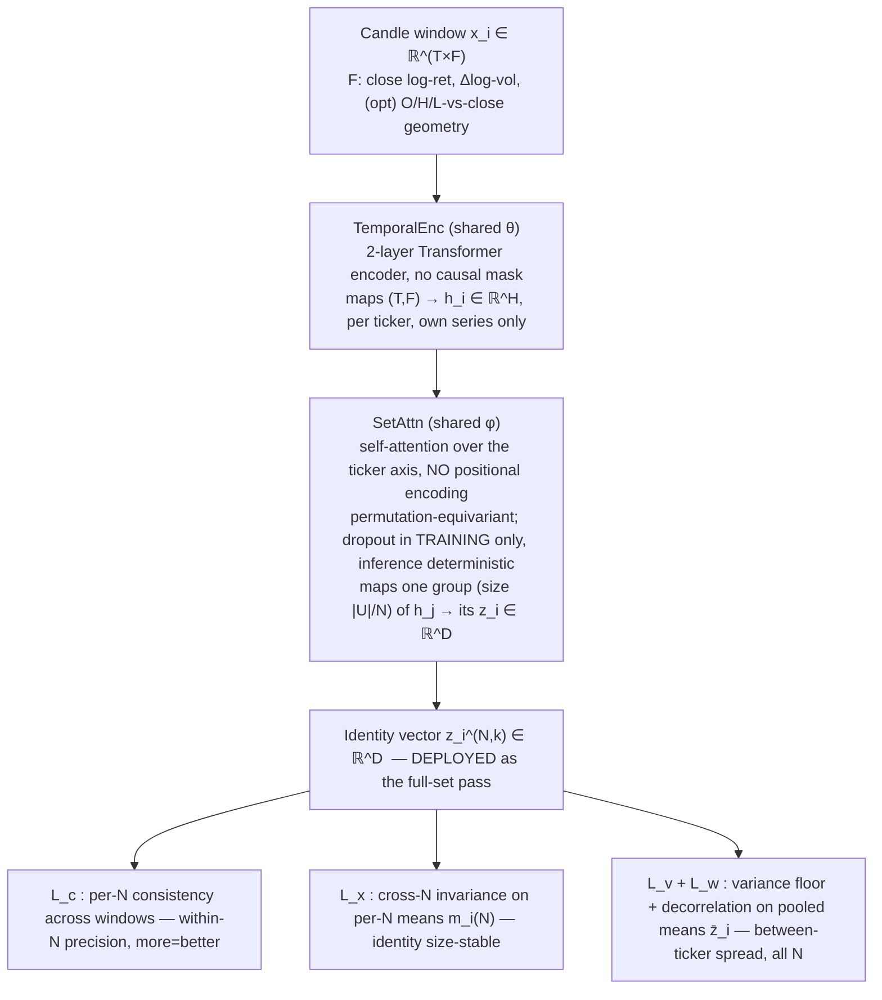
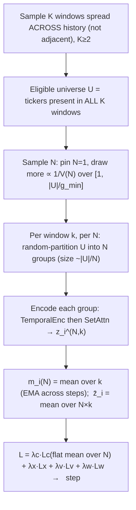

# Stock Identity — Inductive Self-Supervised Relational Embedding

## 1. Purpose

Train one encoder that, at inference, takes a **set** of ticker candle-windows and emits per ticker an **identity vector** `z_i ∈ ℝ^D` with these properties:

| Property | Meaning |
|---|---|
| distinct-in-set | `z_i` separable from other tickers' vectors in the same set |
| label-free | no external/target label anywhere in training |
| temporally consistent | same ticker → near-equal `z_i` across different time windows |
| relational | `z_i` derives from this ticker's relations to others in the set |
| inductive | encoder generalizes to tickers never seen in training |
| unique | competitors stay separated even when same-sector tickers cluster near |

Downstream consumer: a cross-stock situation-reporter module that attends over `{z_i}` as per-ticker identity tokens.

## 2. Method

**VICReg-style non-contrastive self-supervised learning over sets, with temporal positives.**
VICReg = Variance-Invariance-Covariance Regularization: prevents representation collapse with explicit variance + covariance penalties instead of negative samples. "Over sets" = the encoder is permutation-equivariant across the ticker axis (reordering the input tickers reorders the outputs identically; a ticker's output does not depend on its position). "Temporal positives" = the two views of a ticker being pulled together are two different **time windows**, not two augmentations of one image.

Contrastive (InfoNCE) was the alternative; rejected here because it needs many negatives + a temperature and makes the elimination shortcut (§8) more tempting. Non-contrastive preserves every invariant and removes those two knobs.

## 3. Notation

| Symbol | Meaning |
|---|---|
| `T` | window length (trading days) |
| `F` | input features per day (§4; F=2 core, 5 with candle geometry) |
| `U` | the window universe — all eligible tickers present that window (`|U| ≈ 348`) |
| `N` | number of groups `U` is partitioned into; group size ≈ `|U|/N`. **Low N = fewer, bigger groups = more peers; N=1 = the full set (deploy config).** Sampled over `1 ≤ N ≤ |U|/g_min` ∝ inverse-variance (§7) |
| `g_min` | min group size (peers per group), ≈ 8 — caps `N` so every group carries relational signal (no singletons) |
| `V(N)` | expected within-N consistency variance (finite-population correction): `∝ (N−1)/(|U|−1) + v₀`; `v₀` = full-set non-sampling-noise floor; fit from §9 probe |
| `K` | windows sampled per training step (`K ≥ 2`) |
| `H` | temporal-encoder hidden width |
| `D` | identity-vector dim (deployed) |
| `z_i^{(N,k)}` | identity of ticker `i` in window `k` under an `N`-group partition |
| `m_i^{(N)}` | per-N mean: mean of `z_i^{(N,·)}` over windows/draws at partition count `N` (EMA-tracked) |
| `z̄_i` | pooled per-ticker identity: mean of `z_i` over `N` × windows |
| `ID_i` | deployed static identity: mean over windows of the full-set pass (§12) |
| `λ_c,λ_x,λ_v,λ_w,λ_r` | loss weights (per-N consistency, cross-N invariance, variance, covariance, gated relational synergy §6) |
| `γ` | target per-dim std in the variance floor (≈ 1) |
| `sg(·)` | stop-gradient (treated as constant in backprop) |

## 4. Input representation (Fork A)

Per ticker per day, from raw OHLCV `(O,H,L,C,V)`:

| # | Channel | Formula | Note |
|---|---|---|---|
| 1 | close log-return | `log(C_t / C_{t-1})` | core |
| 2 | volume log-change | `log(V_t / V_{t-1})` | core; level-free volume |
| 3 | open geometry | `log(O_t / C_t)` | optional candle shape |
| 4 | high geometry | `log(H_t / C_t)` | optional candle shape |
| 5 | low geometry | `log(L_t / C_t)` | optional candle shape |

Then divide each channel `c` by **one global constant** `s_c` = std of channel `c` over all tickers' training rows (one scalar per channel, **not** per-ticker, no per-ticker centering).

Rationale (terse):
- Absolute price/volume **level** is stable per ticker but a trivial lookup → would make consistency free and defeat inductivity → removed by differencing.
- Global (not per-ticker) scaling fixes optimization scale **without** erasing volatility: a 2×-volatility ticker stays 2× after scaling, so volatility-magnitude survives as an identity signal.
- The 40+ engineered indicators are deliberately excluded — they pre-bake structure and bloat input. Optional add-on: append per-window realized volatility as a scalar side-feature; default off (raw log-returns already carry it).

## 5. Architecture



- **TemporalEnc**: 2-layer Transformer encoder. At `T=60`, Mamba's long-sequence advantage is moot and adds CUDA/triton install friction — use it only if `T` grows past ~500. SetAttn is the load-bearing relational part; spend complexity there.
- **SetAttn**: standard self-attention with **no positional encoding** on the set axis → permutation-equivariant and size-agnostic by construction; this is what lets the **N-sweep** (§7) train one encoder across all group sizes and makes the size-invariance `L_x` (§6) attainable. At `|U| ≈ 348` full `O(|U|²)` attention is cheap; switch to Set-Transformer induced points (ISAB) only if `|U|` grows large.
- **Dropout** = standard regularizer, active in training only. **Inference runs in eval mode → deterministic `z_i`** (a stable ID must not vary per forward pass, and there is no uncertainty-quantification consumer here — unlike the separate price predictor). Anti-elimination never depended on inference-time dropout; re-partitioning + the N-sweep + `L_c` (§8) carry it.

## 6. Losses

All gradients flow through the encoder; **no labels** enter anywhere. Each training step samples a few `N` (number of groups; low N = bigger groups = more peers, §7); the loss compounds per-N terms with two cross-N terms.

- **Per-N consistency** (temporal + neighbor invariance), on `z`, **flat weight over the sampled `N`** (big-group emphasis lives in how `N` is *sampled*, §7 — not a multiplier):
  `L_c = mean_{N ∈ sampled} mean_i [ (1/K) · Σ_k ‖ z_i^{(N,k)} − m_i^{(N)} ‖² ]`
  Variance of ticker `i` across the `K` windows at partition count `N`, then a plain mean over the sampled `N`. Drives **within-N precision**; "more = better" emerges because larger groups (lower `N`) genuinely lower this variance — toward `0` at `N=1` (the full set). Random re-partition each window → invariance to neighbor composition (`N=1` has no partition choice → trains the deploy config's pure cross-window consistency). A steep per-`N` multiplier is **not** used: under per-step normalization it collapses onto whichever low-`N` is drawn and starves the rest, breaking `L_x` and the slope.

- **Cross-N invariance** (size-invariance), on the **per-N means** `m_i^{(N)}`:
  `L_x = mean_i Var_N( m_i^{(N)} )`
  Pulls a ticker's identity together across group sizes → the ID does not depend on how many peers it was scored with. Computed **on the means, not raw draws**: raw-draw tying would also equalize small- vs big-group *precision* and flatten "more = better"; mean-tying penalizes only genuine size-drift. EMA-track `m_i^{(N)}` across steps for a cheap de-noised target.

- **Variance floor** (anti-collapse), on the pooled means `z̄_i`, per dimension `d`:
  `L_v = mean_d max(0, γ − √( Var_i(z̄_{i,d}) + ε ))`  (`ε ≈ 1e-4`)
  The `ε` is the VICReg numerical guard — without it the gradient `∝ 1/√Var` diverges as a dimension collapses, exactly when the floor must push outward (and at init, where per-dim variance is tiny). Variance over the batch of pooled per-ticker means (de-noised over N × windows). Forces each dimension to carry between-ticker spread → no collapse; "no ticker like another at any N" holds in the mean (what deployment consumes). On means, not the raw pool, so within-ticker noise cannot pad the floor.

- **Covariance / decorrelation** (full-rank use), on the pooled means `z̄_i`:
  `L_w = (1/D) · Σ_{d≠d'} [ Cov_i(z̄) ]²_{d,d'}`
  Off-diagonal covariance → 0 → embedding uses its full capacity → sharper uniqueness.

- **Relational synergy** `L_r` (**gated** — on only if the §9 attention-concentration probe reads narrow; off by default). Forces peers to be *used* without dictating *which* relation. Three masked passes of SetAttn through the **same shared encoder** give ticker `i` three embeddings: `z_i^self` (`i` attends to itself only → own-series), `z_i^grp` (`i` attends to peers only → relational), `z_i^both` (normal — the deployed config). With a quality score `acc = −Var_k(z_i)` (consistency; higher = more consistent) and margin `m`:
  `L_r = mean_i [ relu( acc(z_i^self) − acc(z_i^both) + m ) + relu( acc(z_i^grp) − acc(z_i^both) + m ) ]`
  `acc(both) ≥ acc(self) + m` forces peers to add value → relational; `acc(both) ≥ acc(grp) + m` forces own-series to add value → keeps volatility-as-identity. Neither source is droppable; **synergy is forced, not merely floored** — the margin `m` is what makes it a force (without it `both ≈ self` ties and the own-series shortcut survives). Cost: 3× SetAttn passes; deployed config is `both`. Target-agnostic by design (uses the model's own consistency, not a chosen relation like correlation) — fits "any relation that works".

Total: `L = λ_c·L_c + λ_x·L_x + λ_v·L_v + λ_w·L_w`  (`+ λ_r·L_r` when gated on).

All terms act in `z`-space — `L_v`/`L_w` on the pooled means `z̄_i`, `L_c`/`L_x` on the per-window / per-N embeddings. The floor sits in the same space the consistency/invariance pulls would shrink: a global contraction that cheapens `L_c`/`L_x` immediately violates `std_i(z̄_{i,d}) ≥ γ`, so the floor anchors the embedding scale.

Property → enforcing mechanism:

| Property | Enforced by |
|---|---|
| distinct-in-set | `L_v`, `L_w`, SetAttn |
| label-free | scheme has no labels |
| temporally consistent | `L_c` |
| relational | SetAttn + `L_v` on own-series-**confusable** pairs (forces peer-use; measured, §9) |
| inductive / size-invariant | shared weights + `L_x` + held-out-ticker eval |
| unique | `L_v` + `L_w` |

Starting weights (tune): `λ_c=25, λ_x=10, λ_v=25, λ_w=1` (gated relational: `λ_r≈1`, margin `m` = a small consistency gap). Defaults: `T=60, H=128, D=128, K=2–4, γ=1`, `g_min≈8`. Per step: pin `N=1`, draw a few more `N ∈ [1,|U|/g_min]` from `P(N) ∝ 1/V(N)` (inverse-variance / precision weighting); `V(N) ∝ (N−1)/(|U|−1) + v₀` (finite-population correction — `|U|` baked in, `0` sampling-noise at `N=1`), `v₀` fit from the §9 more=better probe.

## 7. Training step



```python
def step():
    W = sample_K_windows_spread_across_history()        # K >= 2
    U = tickers_present_in_all(W)                        # eligible universe
    z = nested_dict()                                    # z[N][k][i]
    for N in sample_Ns(U):                               # pin N=1 + a few ~ P(N)∝1/V(N), over [1, |U|//g_min]
        for k, w in enumerate(W):
            for grp in random_partition(U, n_groups=N):  # re-partition each window
                h = TemporalEnc(features(w, grp))        # (|grp|, T, F) -> (|grp|, H)
                z[N][k].update(zip(grp, SetAttn(h)))     # group size ~ |U|/N; dropout on
    m    = {N: {i: mean_k(z[N][k][i]) for i in U} for N in z}   # per-N means (EMA-de-noise across steps)
    zbar = {i: mean_N(m[N][i] for N in z) for i in U}           # pooled per-ticker identity
    M    = stack([zbar[i] for i in U])                          # (|U|, D)
    Lc = mean_N(mean_i(var_k(z[N][k][i])) for N in z)          # flat mean over sampled N
    Lx = mean_i(var_N(m[N][i] for N in z))                      # cross-N invariance, on per-N means
    Lv = mean_d(relu(gamma - sqrt(var_batch(M[:, d]) + eps)))   # floor on pooled means; eps guards 1/sqrt(var)
    Lw = offdiag_sq_sum(cov_batch(M)) / D                       # 1/D normalization (matches §6)
    (lam_c*Lc + lam_x*Lx + lam_v*Lv + lam_w*Lw).backward()
    opt.step()
```

Sampling rules that matter:
- **Windows spread across history**, not adjacent. Adjacent windows share near-identical price content → consistency becomes trivial; spread windows force identity to survive regime change.
- **Sample `N`, re-partition every window.** Pin `N=1` (full set = deploy config) and draw a few more `N` from `P(N) ∝ 1/V(N)` over `[1, |U|/g_min]` (need ≥2 distinct `N` for `Var_N`; cap at group size `g_min` — singleton groups carry no relational signal). Don't enumerate all `N` per step (`~|U|` encodes — wasteful); the range is covered over steps. Random partitions at `N>1` are the anti-elimination pressure; `N=1` has no partition choice.
- **Emphasis = sampling, not a weight.** `P(N) ∝ 1/V(N)` is inverse-variance (precision) weighting — the GLS-optimal way to combine estimators of differing precision — with `V(N) ∝ (N−1)/(|U|−1) + v₀` the finite-population-corrected within-N variance (`|U|` baked in; `0` sampling-noise at `N=1`, floored by `v₀`). Per-step weights stay flat — a steep multiplier would collapse onto the drawn low-`N`. Fit `V(N)` from the §9 more=better probe; expect extra steepening toward `N=1` if relational structure dominates (Marchenko–Pastur).
- **Eligible `U` = present in all `K` windows** so the per-N cross-window variance `L_c` is computable for every ticker.

## 8. Why it does not degenerate

| Degenerate solution | Guard |
|---|---|
| full collapse (all `z` equal) | `L_v` per-dim std floor |
| dimensional collapse (spread in 1–2 dims) | `L_w` decorrelation |
| trivial consistency via price/volume level | level-free inputs (§4) |
| elimination shortcut ("I'm the odd one out in this group") | random re-partition + N-sweep → no fixed peer set to exploit; `L_c` across different neighbor sets |
| memorize a narrow set of specific peers | `L_x` cross-N invariance: a composition/size-dependent feature is not N-invariant → penalized |
| own-series shortcut (ignore peers entirely → trivially consistent, non-relational) | **not** loss-blocked by invariance terms (peer-independence games them all); `L_v` on own-series-**confusable** pairs forces peer-use to separate them; strength = how many such pairs exist → **measured** by the attention-concentration probe (§9), not assumed |

Two narrow failures, two guards: *memorize specific peers* is killed by `L_x` (size/composition-dependence ⇒ penalized); *ignore all peers* is reached only as far as own-series features can discriminate, and `L_v` forces relations wherever own-series can't separate two tickers. The residual — does the encoder aggregate broadly — is **measured** (attention concentration / peer-swap sensitivity, §9), with the gated relational-synergy term `L_r` (§6) as the lever if the probe reads narrow.

## 9. Evaluation probes

| Probe | Measures | Pass condition |
|---|---|---|
| discriminability ratio = between-ticker var / within-ticker across-window var | core health | `> 1` and rising |
| same ratio on **held-out tickers + held-out time** | inductivity | comparable to train tickers |
| cross-N drift: `m_i(N)` across partition counts `N` | size-invariance (`L_x`) | small mean-drift |
| more=better slope: within-N variance vs group size | peers actually help | variance falls as groups grow |
| attention concentration / peer-swap sensitivity | actually relational (not own-series, not memorized) | attention spread over many peers; `z_i` tracks peer *structure*, stable to peer *identity* |
| effective rank (participation ratio of `cov(z̄)`) | full-rank use | `≈ D` |
| sector kNN purity vs known peers (eval-only labels) | close-but-distinct | high purity, non-zero pairwise distance |

The attention-concentration row **gates `L_r`** (§6): a narrow reading (attention on few peers, `z_i` insensitive to peer swaps) turns the relational-synergy term on; otherwise leave it off. The more=better row **fits `V(N)`** (§7): its within-N-variance-vs-group-size curve yields `v₀` and any curvature, which set the `N`-sampling `P(N) ∝ 1/V(N)`.

## 10. Caveats

- **Rotation identifiability.** Variance/covariance losses are invariant to orthogonal transforms → the embedding is defined only up to an isometry. Two separately-trained encoders produce **non-comparable** vectors. Train once, **freeze**, reuse.
- **Causal windows downstream.** When `z_i` feeds a predictor at time `t`, build its window from candles `≤ t` only — no lookahead leak. SSL **training** windows may sit anywhere in history.
- **Freeze for the consumer.** The cross-stock reporter consumes frozen `z` as fixed per-ticker identity tokens; do not co-train it against a moving encoder unless intentionally fine-tuning end-to-end.

## 11. Downstream hook

Inference (eval mode, deterministic). Each ticker's identity token is its frozen static `ID_i` (§12). The reporter attends over `{ID_i}` for the tickers in scope, combined with the current decision window's dynamics, to produce cross-stock situation features for the target ticker. Set size is unconstrained by construction (SetAttn + `L_x` size-invariance).

## 12. Deploying the ID (static, per-window mean)

Premise: identity is stationary → each window's inference is a noisy observation of one fixed `μ_i`; averaging over windows reduces that noise (variance reduction, not time-blending). Per-window scope is **not** fixed — it is whatever tickers are present that window — so comparability/averageability rests on **`L_x` (cross-N invariance, §6)** making `z` approximately independent of group size, **not** on the scope being constant. Freeze the mean as `ID_i`, reuse.

Procedure:
1. Tile history into windows spaced by stride ≥ `T` → near-independent samples. Overlapping windows are near-duplicate draws: they pad the count without tightening the mean. "Resolution" = the number of *independent* windows a ticker appears in.
2. Per window `w`: one eval-mode (deterministic) pass over **the full present set** (`N=1` — the largest scope, most peers, most precise) → one `z_i^{(w)}` per ticker. `L_x` makes the size choice safe; **no small groups, no covering** at inference.
3. Per ticker: `ID_i = mean_w z_i^{(w)}` over the windows where `i` appears, equal weight (no recency tilt — stationary-sample premise). Freeze → deployed artifact.
4. Coverage varies → resolution varies (short-history tickers get fewer samples; acceptable, not critical). `σ_i = std_w( z_i^{(w)} )` = per-ticker resolution / stability readout: high → identity in flux or under-sampled, consumer may downweight. (Single-window ticker → no average, `σ_i` undefined → flag low-confidence.)

Do **not** report a `σ/√(#windows)` standard error: the per-window samples are not iid (overlapping windows, drifting present-set), so a calibrated SE would overstate confidence — `σ_i` is the honest resolution signal.

Train/deploy scope match: deployment scores the full set (`N=1`); training sweeps `N ≥ 2`. `L_x` makes the identity size-invariant, so `N=1` is the in-distribution large-group limit, not a special pass — no universe branch, no covering, no small-group inference. Residual: fidelity of the `N=1` extrapolation scales with `λ_x`; if it drifts, raise `λ_x` or extend the swept counts toward `N=1` (the full set) during training.

Point-in-time discipline: a full-history `ID_i` has seen data after any past date, and stationary-by-intent does **not** make it causal — lookahead features can still hide in the estimate (it is a function of the averaged windows, post-date ones included). So full-history IDs are for **non-decision use only** (offline clustering, viz).

**Integration contract (deferred — not wired now):** when `ID_i` feeds the main prediction model, it is built from a window set with **no candles after that model's as-of point** — bounded by the model's *training* cutoff while training, by the *inference* date while scoring. One frozen ID-set per cutoff, reused across the period (not per day); applies to every path into the prediction model, the situation reporter included.

(Second-order: a past window's present-set holds only survivors-to-today → mild survivorship tint in the relational context; ignore unless exact historical conditioning is needed.)
