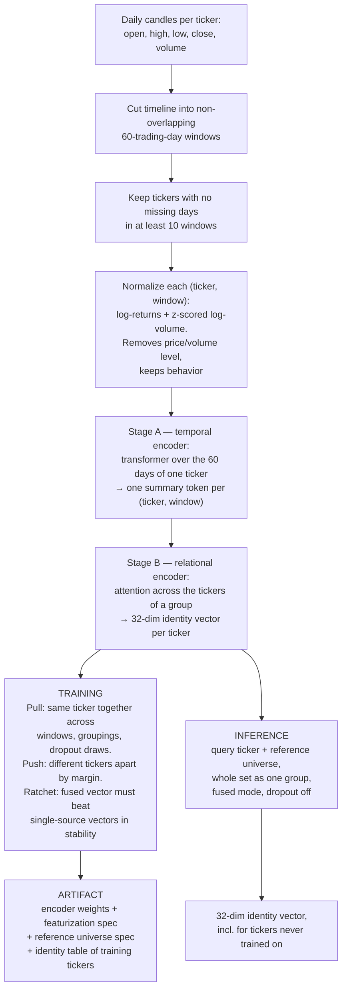
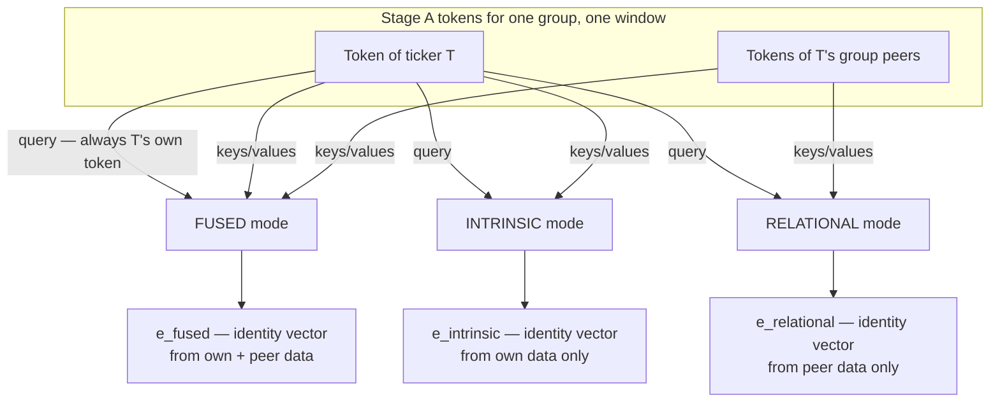
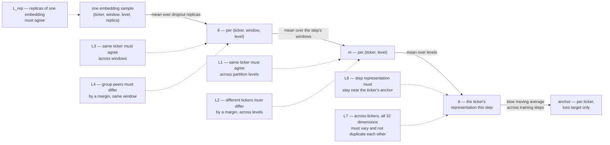

# Stock Identity Encoder — Specification

Status: design spec, pre-implementation. 2026-06-04.

A standalone model, independent of the forecasting pipeline in this repo. It produces, for any stock ticker, a 32-dimensional **identity vector** computed from the ticker's own daily candles and from the candles of other tickers over the same dates. The vector is meant to be consumed as a feature by other ML systems.

## 1. Goal

Training shapes the identity vector to have four properties:

- **Persistent** — the same ticker gets nearly the same vector regardless of which time window is used, how the ticker set was grouped, and dropout randomness.
- **Distinctive** — different tickers get vectors separated by a margin, both within attention groups and globally.
- **Dual-sourced** — the vector computed with both sources available (own data + peers) must be more stable than the vector computed from either source alone, so the model cannot ignore the ticker's intrinsic behavior or its relations.
- **Inductive** — the forward pass contains no per-ticker learned parameters: no ID embeddings, no lookup tables, no timestamps. A ticker never seen in training gets its vector the same way as a training ticker: from its data and its relations to a reference set.

The inductive property is the load-bearing rule. Every other mechanism in this document is pressure applied on top of it.

## 2. System overview



## 3. Terms

| Term | Meaning |
|---|---|
| **window** | 60 consecutive trading days, cut from the timeline without overlap. Each window carries its position `t` (integer index in the tiling). |
| **universe** | The set of tickers processed together in one training step. |
| **partition level `k`** | The number of equal-sized groups the universe is split into. Level 1 = the whole universe as one group. |
| **grouping** | The concrete random assignment of tickers to groups at a level. |
| **context mode** | Which data sources the encoder may read when embedding a ticker: **fused** (own data + peers), **intrinsic** (own data only), **relational** (peers only). |
| **replica** | One of R repeated computations of the same embedding with different dropout randomness. |
| **anchor** | A per-ticker slow-moving average of its representation across training steps. Exists only inside the loss; never used in the forward pass. |
| **reference universe** | The fixed, documented ticker set that provides relational context at inference. |
| **identity table** | The final anchors of all training tickers, shipped as a ready-made lookup artifact. |
| **identity vector** | The model's output: a 32-dimensional vector scaled to length 1. |

## 4. Data

Input is daily OHLCV only (open, high, low, close, volume). No other feeds.

### Windows

- Length N = 60 trading days, stride 60 — windows never overlap. Overlapping windows would share raw days, letting the consistency losses be satisfied by shared data instead of shared identity.
- Window position `t` is used only inside the loss (proximity weighting, §7). It is never a model input.

### Eligibility

A ticker enters training only if it has no missing days in at least 10 windows. Two windows is the hard floor (every consistency comparison needs a pair); the rest is margin so the batch scheduler always finds usable combinations and validation windows can be held out without making the ticker untrainable. Eligibility is counted on training windows only.

### Features

Per day, per ticker, 5 values (the first day of a window needs the previous day's close, so a window consumes 61 raw days):

| Feature | Definition |
|---|---|
| `r_c` | log(close_today / close_yesterday) |
| `r_o` | log(open_today / close_yesterday) |
| `r_h` | log(high_today / close_yesterday) |
| `r_l` | log(low_today / close_yesterday) |
| `v` | log-volume, z-scored (mean subtracted, divided by standard deviation) within that one (ticker, window) pair |

The normalization principle: remove **nominal** scale, keep **behavioral** structure. Price level and share-volume level are arbitrary (stock splits change them) and would let the model identify tickers by trivial fingerprint. Volatility level, bar shape, co-movement, and volume dynamics are genuine behavior and survive the transform. Returns are deliberately **not** divided by per-window volatility — volatility is a real quality, not a fingerprint.

No timestamps, no calendar features, no ticker IDs anywhere in the input. The model must never be able to identify a ticker through a side channel.

## 5. Model

Two encoders, applied in sequence.

### Stage A — temporal encoder

Per (ticker, window): the 60×5 feature matrix goes through a 2-layer transformer encoder (a standard sequence model built from attention layers — attention: an operation where a query item summarizes a set of items as a weighted average, with learned weights). Positions are encoded relative to the window start (day index only). Output is mean-pooled into one summary token `h` of dimension 96.

Stage A runs once per (ticker, window, replica) per step and its output is reused by every level and mode below — the per-day sequence work never repeats.

### Stage B — relational encoder

Per group: 2 blocks of attention applied across the group members' Stage-A tokens. No positional encoding across tickers — the operation is order-independent. Attention normalizes over however many keys are present — the operation is group-size-independent. A single shared output head maps to 32 dimensions, then the vector is scaled to length 1.

Length-1 scaling closes a degenerate strategy: without it, "push different tickers apart" is satisfiable by inflating all vector magnitudes and "pull same ticker together" by shrinking them. On the unit sphere only direction matters.

### Context modes

For a query ticker T in group G, the three modes differ **only** in which tokens serve as attention keys/values (the content sources). The query is always T's own token.



Three rules:

- **Masking restricts content, never the query.** In relational mode, T's token steers the attention (selects which peer information is relevant to T) but contributes no content. This is forced, not a compromise: if the query were a shared T-blind probe, every member of a group would receive a near-identical relational embedding, and within-group separation (loss L4) would be unattainable for that mode.
- **Intrinsic mode is independent of grouping** (its keys are just T's own token), so it is computed once per (ticker, window, replica), with no level axis. Its grouping-consistency loss L1 is zero by construction.
- **All modes share all parameters.** The mask is the only difference, so stability comparisons across modes (loss L5) compare like with like.

### Dropout

Dropout = randomly zeroing a fraction of internal values during training so the model cannot rely on any single one. Two kinds here, both training-only; inference is fully deterministic.

- **Feature dropout** (rate 0.1, both stages): for a fixed (ticker, window, level, replica), the same dropout masks are used across all three modes — so differences between modes reflect the masking, not noise. Masks differ across replicas.
- **Peer-edge dropout** (rate 0.15, Stage B): each (query, peer) attention edge is dropped independently, per replica and per query. The relational summary must survive losing any individual peer, so it cannot be a memorized lookup of specific group-mates. In relational mode at least one peer is kept visible (redraw if all edges drop).

R = 2 replicas per step. Replica disagreement is itself penalized (loss L_rep), which is the mechanism forcing identity to rest on robust qualities rather than fragile detail.

Normalization layers are LayerNorm only (uses one item's own values). **No BatchNorm** (uses statistics of the whole batch) — it would mix information across tickers in a batch and behave differently at inference.

## 6. Training step assembly

Each step:

1. **Windows**: take the next X = 6 windows from this epoch's random permutation of all training windows — every window is used once per epoch before any reuse, and groupings never repeat across reuses (see step 4). Batches are assembled to mix near-in-time and far-in-time windows, so the proximity weighting in §7 sees a range of distances.
2. **Universe**: a random subset (≤ 128 tickers) of the tickers eligible in **all** X windows. If the intersection is smaller than 32, redraw the window batch.
3. **Levels**: a set K containing level 1 (whole universe, always included — it is the inference context) plus sampled levels, with the smallest group size ≥ 8. Example at universe 128: K = {1, 4, 16}. At least two levels per step (the cross-level losses need pairs).
4. **Groupings**: one random equal-sized partition per level per step, **shared across the step's X windows** — so "same ticker, same peers, different window" is a controlled comparison; group composition still changes every step. The partition is seeded by hash(epoch, step, level): reproducible, and repeats are structurally impossible. If the universe doesn't divide evenly, group sizes may differ by 1.

```
for each training step:
    W ← next 6 windows from this epoch's permutation
    U ← random subset (≤128) of tickers eligible in all of W
    K ← {1} ∪ sampled levels, smallest group ≥ 8
    for k in K:  P_k ← partition of U into k groups, seeded by hash(epoch, step, k)

    for r in 1..2:                                        # dropout replicas
        h[i,w] ← StageA(features(i,w))                    # every ticker i, window w
        e_intr[i,w,r] ← StageB(query=h[i,w], keys/values={h[i,w]})        # once, no level axis
        for k in K, group G in P_k, ticker i in G, window w in W:
            e_fused[i,w,k,r] ← StageB(query=h[i,w], keys/values={h[j,w] : j in G})
            e_rel[i,w,k,r]   ← StageB(query=h[i,w], keys/values={h[j,w] : j in G, j ≠ i})

    aggregate replica/window/level means; compute losses (§7); backprop; optimizer step
    update anchors (§7, L6)
```

## 7. Loss

### Notation

```
e[i,w,k,r]   one embedding sample: ticker i, window w, partition level k, replica r
             (each context mode has its own e; intrinsic mode has no k axis)
ê[i,w,k]     mean over replicas r
m[i,k]       mean over the step's windows w
ē[i]         mean over levels k  — ticker i's representation this step
hinge(x)     max(0, x) — contributes only while a constraint is violated, silent once satisfied
sg(x)        stop-gradient: x is used as a constant; training adjusts nothing through it
‖a − b‖      Euclidean distance. All vectors have length 1, so distances lie in [0, 2];
             two random 32-dim unit vectors are ≈ 1.41 apart — this calibrates the margins.
```

How the aggregates relate, and where each loss attaches:



L5 is not in the chart: it compares whole modes against each other (below).

L_rep and L1–L4 are computed per mode, then combined with mode weights (fused 1.0, intrinsic 0.5, relational 0.5). For the intrinsic mode, which has no level axis: L1 ≡ 0, and L2 runs over plain ticker pairs.

### Pull terms (consistency)

**L_rep — replica consistency.** Identity must survive dropout perturbation.

```
L_rep = mean over (i,w,k) of   mean over r of  ‖e[i,w,k,r] − ê[i,w,k]‖²
```

**L1 — grouping consistency.** A ticker's representation must not depend on how the universe happened to be partitioned.

```
L1 = mean over i of   mean over k of  ‖m[i,k] − ē[i]‖²
```

**L3 — temporal consistency.** The core term: a ticker's representation must not change across windows. Pairwise over the step's windows, with two weightings.

```
L3 = mean over i of   [ Σ_k ρ_k · Σ_{w<w′} ω(|t_w − t_w′|) · ‖ê[i,w,k] − ê[i,w′,k]‖² ]
                    / [ Σ_k ρ_k · Σ_{w<w′} ω(|t_w − t_w′|) ]

ω(Δ) = 1 + exp(−Δ/3)        proximity weighting (Δ in window units): instability between
                             near-in-time windows is penalized up to 2×; the factor decays
                             to 1 with distance. Near-window stability is non-negotiable;
                             long-range settlement is L6's job.
ρ_k = g_k / (g_k + 8)        context-mass weighting (g_k = group size at level k): smaller
                             groups give noisier relational context, so their instability
                             counts proportionally less.
```

L1 and L3 are a clean decomposition: the total spread of a ticker's embeddings over (window, level) splits exactly into an across-level part (L1) and an across-window part (L3). No double counting.

### Push terms (separation)

Both use a margin: push apart until the required distance is reached, then stop. Hinged terms self-retire — this, not hand-tuned decay schedules, is what keeps the push terms from fighting the pull terms forever.

**L2 — global separation.** Any two tickers, compared across different levels, must differ. Given L1 holds, this separates them within levels too, and it covers ticker pairs that never share a group (which L4 cannot reach).

```
L2 = mean over sampled pairs {(i,k),(j,k′) : j ≠ i, k′ ≠ k} of   hinge(1.0 − ‖m[i,k] − m[j,k′]‖)²
```

Pairs are subsampled for cost. Margin 1.0 against the ≈1.41 random-pair baseline.

**L4 — local separation.** Peers inside the same group — the pairs the attention actually computed together — get the strongest, best-informed push, with a tighter margin.

```
L4 = mean over (k, w, group G, i∈G, j∈G\{i}), weighted by ρ_k, of
         hinge(0.7 − ‖ê[i,w,k] − ê[j,w,k]‖)²
```

### L5 — relational gain (the mode ratchet)

Define each mode's **instability** as its pull-term sum: `T_mode = L1_mode + L3_mode` (for intrinsic, just L3). Lower T = more stable.

```
L5 = hinge( T_fused − 0.8 · sg(min(T_intrinsic, T_relational)) )
```

Meaning: the fused embedding must be at least 20% more stable than the better of the two single-source modes (beating the better one beats both). The baseline inside sg() is frozen each step, so this constraint **cannot** be satisfied by degrading the single-source modes — gradient flows only into improving the fused one. The single-source modes are trained solely by their own copies of L_rep and L1–L4, which keep them as good as they can be. Net effect: own-data-only and peers-only pathways are each forced to be individually strong, and the fused pathway is forced to combine them into something strictly stabler — neither source can be ignored.

L5 turns on after a 2-epoch warm-up (before the pathways stabilize, the baseline is noise).

### L6 — identity anchor (settlement across training time)

Each training ticker has an anchor `a_i`: a slow-moving average of its fused-mode step representations. Initialized to `ē_fused[i]` the first step the ticker appears (no L6 contribution that step). Each later step, in this order:

```
L6:      mean over i of  ‖ē_fused[i] − sg(a_i)‖²          penalize against the pre-update anchor
update:  a_i ← scale_to_length_1( (1 − c)·a_i + c·ē_fused[i] )
         c  = 0.05 · L̄ / (L̄ + L_step)                      anchor moves faster when this step's loss
         L̄  ← 0.99·L̄ + 0.01·L_step                          is below its running average — the model
                                                            is trusted more when it is doing well
```

The pull works both ways: the model is drawn toward the anchor (L6), and the anchor chases the model (the update), faster under low loss — so the anchor never goes stale. Penalizing before updating prevents a confident step from absorbing its own penalty. The anchor never enters the forward pass — the inductive property is untouched — and the final anchors double as the shipped **identity table**.

### L7 — dimension usage

Prevents the model from packing identity into a few dimensions and leaving the rest dead or duplicated. Over the step's fused representations, centered: `b_i = ē_fused[i] − mean_j ē_fused[j]`, with per-dimension standard deviation `s_d` and covariance matrix `C`:

```
L7 = Σ_d hinge(0.18 − s_d)²   +   Σ_{d≠d′} C[d,d′]²
```

First sum: every dimension must vary across tickers (0.18 ≈ 1/√32, the per-dimension spread of vectors spread evenly over the sphere). Second sum: no two dimensions may encode the same thing. Together with L2/L4 this also blocks the global failure mode of all pull terms — everything collapsing to one point.

### Total

```
L = Σ_modes α_mode · ( λ1·L1 + λ2·L2 + λ3·L3 + λ4·L4 + λrep·L_rep )
    + λ5·L5 + λ6·L6 + λ7·L7

α_fused = 1.0,  α_intrinsic = α_relational = 0.5
```

Weight calibration: start all λ at 1; after ~300 steps rescale each λ so every term contributes the same order of gradient magnitude on the embeddings; then leave them fixed. Schedules: λ5 ramps in after the 2-epoch warm-up; λ6 activates from epoch 2 (epoch 1 initializes anchors); everything else constant.

## 8. Inference and artifact

To embed a ticker (training-set or unseen) as of date D:

1. Build its 5-feature window(s) ending at D (61 raw days per window).
2. Build the same windows for every reference-universe ticker.
3. Stage A on all tickers; Stage B in **fused mode, level 1** (the whole reference set plus the query as one group); dropout off.
4. Output: the 32-dim identity vector. Average over the last few windows if a smoother value is wanted.

The shipped artifact has three parts, all under the same version:

1. **The function** — encoder weights + featurization spec. The inductive object: embeds tickers never seen in training.
2. **The reference universe spec** — which tickers, which window length. The embedding is relational by design, so it is conditioned on this set; leaving it undocumented makes embeddings irreproducible.
3. **The identity table** — final anchors for all training tickers, for direct lookup without running inference.

## 9. Evaluation

Holdouts: the most recent windows (time holdout) and ~10% of tickers excluded from every training universe (inductive holdout).

| Check | Method | Want |
|---|---|---|
| Persistent + distinctive, one number | Embed each ticker in two disjoint held-out windows; for each vector from window A, find the nearest vector from window B among all tickers. Report match rate (Recall@1) and mean reciprocal rank. | High |
| Inductive (headline metric) | Same retrieval, on held-out tickers only. | High |
| Stability over time | Mean same-ticker distance as a function of window gap. | Low, flat-ish, rising slowly |
| Relational gain | T_fused / min(T_intrinsic, T_relational) during training. | Falls below 0.8, stays |
| Reference sensitivity | Same ticker, same window, different random reference subsets → spread of resulting vectors. | Small |
| Dimension usage | Effective rank of the embedding covariance. | Approaches 32 |

During training, log per-term loss curves alongside. Concerns about training dynamics (e.g., "identities may settle into sector-level clusters instead of ticker-level ones") are answered by the retrieval metrics, not argued in advance.

## 10. Hard rules

- No ticker-indexed parameters anywhere in the forward pass.
- No timestamps, calendar features, or ticker IDs as input; window position exists only in loss weights.
- Windows never overlap.
- Masking restricts attention keys/values, never the query.
- Identical feature-dropout masks across the three modes within one replica.
- Groupings never repeat (seeded by hash(epoch, step, level)).
- Dropout off at inference; inference is deterministic.
- Anchors live only in the loss; never in the forward pass, never at inference.
- LayerNorm only; no BatchNorm.
- Inference depends on nothing beyond the model weights and the documented reference universe.

## 11. Configuration (starting values)

```
Data        N=60 days/window, stride 60, eligibility ≥10 windows, OHLCV only
Step        X=6 windows, universe ≤128 (redraw if intersection <32), levels {1,4,16}, min group 8
Stage A     2 transformer layers, width 96, 4 heads, mean-pool
Stage B     2 attention blocks, shared head → 32 dims, scaled to length 1
Dropout     feature 0.1, peer-edge 0.15, replicas R=2
Margins     global 1.0, local 0.7        (vs ≈1.41 random-pair baseline)
L3 weights  proximity ω(Δ)=1+exp(−Δ/3), context-mass ρ(g)=g/(g+8)
L5          κ=0.8, warm-up 2 epochs
L6          c_max=0.05, loss-average rate 0.01, active from epoch 2
L7          per-dim floor 0.18, decorrelation weight 1
Modes       α: fused 1.0, intrinsic 0.5, relational 0.5
λ           init 1 each, gradient-balance once after ~300 steps, then fixed
```
