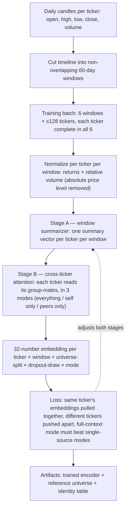
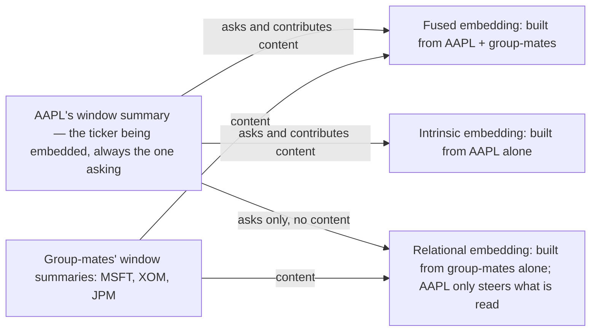
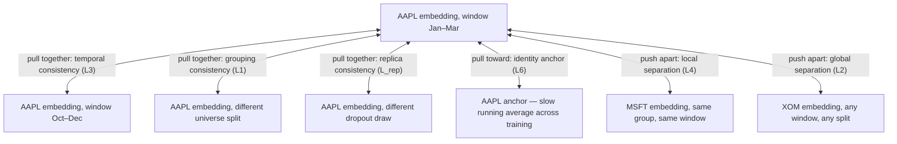
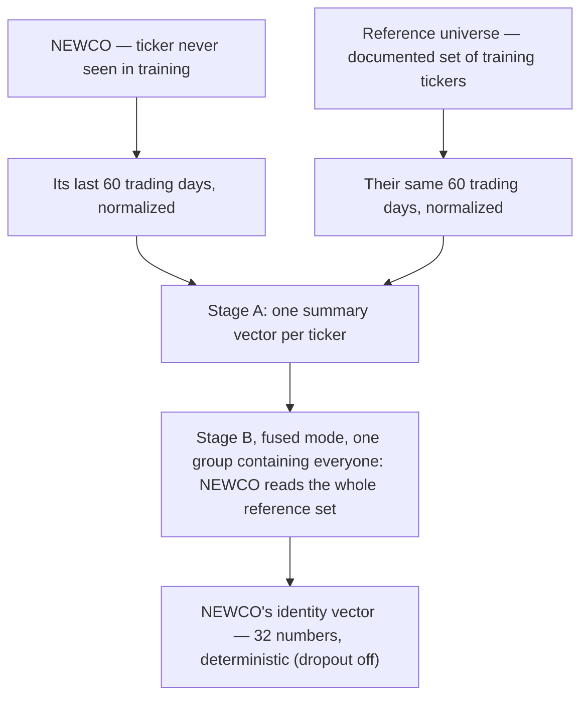

# Stock Identity Encoder — Specification

A model that gives every stock a stable, distinguishing **identity vector**: 32 numbers computed from how the stock behaves and how it relates to other stocks. The vector is meant as an input for other ML systems, and it works for stocks the model never saw during training. This is a standalone model, independent of the existing prediction pipeline in this repo.

## 1. What this builds

One trainable function:

> (a stock's last 60 trading days, normalized) + (the same 60 days of a reference set of other stocks) → 32 numbers



Training shapes the 32 numbers to be:

| Property | Meaning |
|---|---|
| **Persistent** | The same ticker gets nearly the same vector regardless of which time window it is computed from, how the stock universe was grouped, or which random dropout draw was active. |
| **Distinctive** | Different tickers get clearly separated vectors. |
| **Dual-sourced** | The vector must draw on both the stock's own behavior and its relations to other stocks — the loss penalizes the model unless using both beats using either alone. |
| **Inductive** | Works for tickers outside the training set: the model stores nothing per ticker and recomputes identity from data every time. |

## 2. The rule everything depends on

The forward computation contains **no per-ticker parameters and no time inputs**: no ticker IDs, no lookup tables, no timestamps, no calendar features. If the model could see "this is AAPL" or "this is 2019", it could memorize instead of extracting behavior-based identity — and would be useless for unseen tickers. The only per-ticker state (the anchor, §7) lives inside the training loss and is discarded after training.

## 3. Glossary

| Term | Meaning |
|---|---|
| **Window** | 60 consecutive trading days. Windows tile the timeline with no overlap and no gaps. |
| **Universe** | The set of tickers in one training batch; all must have complete data in all of the batch's windows. |
| **Level k** | A way of splitting the universe into k equal-sized groups (k = 1: everyone in one group). |
| **Grouping** | One concrete random split at some level. |
| **Context mode** | Which information sources the model may use when embedding a ticker: **fused** (self + group-mates), **intrinsic** (self only), **relational** (group-mates only). |
| **Embedding** | The 32-number output vector, scaled to length 1. |
| **Attention** | The mechanism by which one ticker's computation selectively reads other tickers' summaries. The reading ticker "asks"; the tickers being read supply "content". |
| **Dropout** | Randomly disabling parts of the computation during training so results cannot depend on any single fragile part. Off at inference. |
| **Replica** | One of R = 2 repeated computations with different dropout draws inside the same training step. |
| **Hinge / margin** | hinge(x) = max(0, x): a penalty active only while a requirement is unmet. Once two embeddings are far enough apart (past the margin), the push stops. |
| **Stop-gradient sg(·)** | The value is used as a number in the loss, but training does not adjust what produced it. |
| **Anchor** | A slowly updated running average of a training ticker's embedding, used as a stability target. |

## 4. Data

### 4.1 Windows and eligibility

- Window length 60 trading days, non-overlapping. Overlap is deliberately avoided: overlapping windows share raw days, so agreement between them would be partly free rather than evidence of stable identity.
- A ticker is eligible only if fully defined (no missing days) in at least 10 windows. The hard floor for trainability is 2 (any same-ticker comparison needs two windows); the rest is margin so the batch scheduler can always pair the ticker up, and so some windows can be held out for evaluation.

### 4.2 Features per day (per ticker, per window)

Computed from candles; needs one extra day on the left for the first return.

| Feature | Formula | Keeps / removes |
|---|---|---|
| close return | log(close_t / close_t−1) | keeps movement, removes price level |
| open, high, low position | log(open_t / close_t−1), same for high and low | keeps bar shape |
| volume | log volume, z-scored within the window (subtract that window's average, divide by its spread) | keeps volume rhythm, removes absolute liquidity level |

Principle: remove **nominal** scale, keep **behavioral** structure. Price level and share volume are arbitrary (stock splits change them) and act as fingerprints that would let the model cheat by memorizing levels. Volatility, bar shape, co-movement, and volume rhythm are genuine qualities — so returns are deliberately *not* divided by window volatility, which would erase a real property.

Nothing else enters the model. Window position in the timeline is used only inside the loss weighting (§7, L3), never as an input.

## 5. Building one training step

1. **Windows** — take the next 6 windows from this epoch's random ordering. Every window is used once per epoch before any window repeats. Batches mix near and far windows so the proximity weighting (§7, L3) sees a range of time gaps.
2. **Universe** — a random subset (≤128) of the tickers that have complete data in *all* six windows.
3. **Levels** — {1} plus a few sampled levels, with the smallest group ≥ 8 members (e.g. {1, 4, 16} at 128 tickers). Level 1 — whole universe as one group — is always included; it is the configuration used at inference.
4. **Groupings** — one random equal split per level per step, shared by the step's six windows ("same ticker, same group-mates, different window" then becomes a clean comparison; composition still changes every step). Each split is seeded by (epoch, step, level), so no grouping is ever reused.

## 6. The model

Two stages. All parameters are shared across modes, levels, and group sizes — the three modes differ *only* in what attention is allowed to read, so comparing them is fair.

**Stage A — window summarizer.** Per (ticker, window): the 60×5 feature matrix passes through a 2-layer attention-based sequence encoder (a small transformer: width 96, 4 heads, day-position encoding) and is averaged into one summary vector. Computed once per (ticker, window, replica) per step and reused by everything downstream.

**Stage B — relational encoder.** Per group: 2 attention blocks across the members' Stage-A summaries. No ordering information across tickers (reordering tickers cannot change results) and attention renormalizes over however many members are present (group size does not matter). A shared output layer produces 32 numbers, scaled to length 1.



| Mode | Content sources | Reads as |
|---|---|---|
| Fused (F) | the ticker + its group-mates | everything |
| Intrinsic (S) | the ticker only | own behavior |
| Relational (P) | group-mates only | what its relations say |

Two structural facts:

- **The asking side is always the ticker itself; masking restricts content only.** In relational mode the ticker steers what is read from peers but contributes no content. This is forced, not a leak: if the asking side were ticker-blind, every member of a group would receive a nearly identical relational embedding, and within-group distinctness would be impossible.
- **Intrinsic mode ignores grouping** (its only source is itself), so it is computed once per (ticker, window, replica). It has no level axis; its grouping-consistency loss is zero by construction, and its global-separation loss reduces to plain ticker-vs-ticker separation.

**Dropout (training only).** Two kinds:

- *Feature dropout* (rate 0.10, both stages): for a fixed (ticker, window, level, replica), the masks are identical across the three modes — so differences between modes measure masking, not random noise.
- *Peer-edge dropout* (rate 0.15, Stage B): each (asking ticker → peer) connection is dropped independently. The relational summary must survive losing any given peer, so it cannot be a memorized lookup of specific group-mates. At least one peer is always kept.

Each step runs R = 2 replicas (independent dropout draws); their disagreement is directly penalized (§7, L_rep). Inference runs with dropout off and is deterministic.

Implementation note: normalize activations with LayerNorm only, never BatchNorm — BatchNorm would leak other tickers' batch statistics into an individual embedding and behaves differently at inference.

## 7. The loss — what training rewards and punishes

Every embedding sample is indexed by (ticker i, window w, level k, replica r, mode). Ticker is the **identity axis**; window, level, and replica are **nuisance axes**. The whole loss is: *pull along every nuisance axis, push along the identity axis, require fused mode to beat the single-source modes, anchor across training time.*

| Pressure | Between | Term |
|---|---|---|
| pull together | same ticker, different windows | L3 temporal consistency |
| pull together | same ticker, different universe splits | L1 grouping consistency |
| pull together | same ticker, different dropout draws | L_rep replica consistency |
| pull together | same ticker, across training steps | L6 identity anchor |
| push apart | different tickers, same group | L4 local separation |
| push apart | different tickers, anywhere | L2 global separation |
| spread out | all 32 dimensions, across tickers | L7 spread & decorrelation |
| fused must win | full context vs self-only and peers-only | L5 relational gain |



### 7.1 Notation

```
e[i,w,k,r]   embedding of ticker i, window w, universe split into k groups, dropout draw r
ê[i,w,k]     e averaged over dropout draws
m[i,k]       ê averaged over the step's windows
ē[i]         m averaged over levels — the ticker's overall representation this step
‖a − b‖      distance between two embeddings. All embeddings have length 1, so distance
             is bounded by 2; two random 32-dim length-1 vectors sit ≈ 1.41 apart.
hinge(x)     max(0, x)
sg(v)        stop-gradient
```

L_rep, L1, L2, L3, L4 are each computed three times — once per mode — then combined with mode weights α (fused 1.0, intrinsic 0.5, relational 0.5).

### 7.2 The terms

**L_rep — replica consistency** (pull across dropout draws)

```
L_rep = average over (i, w, k) of   average over r of   ‖e[i,w,k,r] − ê[i,w,k]‖²
```

Identity must survive random perturbation of the computation; whatever the vector encodes cannot hinge on any single internal pathway.

**L1 — grouping consistency** (pull across universe splits)

```
L1 = average over i of   average over k of   ‖m[i,k] − ē[i]‖²
```

A ticker's representation must not depend on how the universe happened to be partitioned. Zero by construction for intrinsic mode. L1 and L3 split the total wander of a ticker's embeddings into an across-splits part (L1) and an across-windows part (L3) — no double counting.

**L2 — global separation** (push, any ticker pair)

```
L2 = average over sampled pairs {(i,k), (j,k′) : j ≠ i, k′ ≠ k} of
         hinge( 1.0 − ‖m[i,k] − m[j,k′]‖ )²
```

Any two different tickers must sit at least 1.0 apart (vs ≈ 1.41 for random vectors); beyond that the push stops. Pairs are compared across different splits — given L1, a ticker's embedding barely depends on the split, so separating across splits separates everywhere. L2 is what pushes apart tickers that never share a group; L4 cannot reach those pairs. Pairs are subsampled for cost.

**L3 — temporal consistency** (pull across windows; the core term)

```
L3 = average over i of
       [ Σ over k of  ρ_k · Σ over window pairs (w, w′) of  ω(Δ) · ‖ê[i,w,k] − ê[i,w′,k]‖² ]
       ÷ [ the same Σ of weights ]

ω(Δ) = 1 + exp(−Δ / 3)      Δ = time gap between the two windows, in window units
ρ_k  = g_k / (g_k + 8)      g_k = group size at level k
```

The same ticker in two different windows must look the same. Two weightings:

- *Proximity weighting ω*: pairs of windows close in time are penalized up to 2× — near-window stability is non-negotiable, while far-window drift is still penalized but at base weight. Long-range coherence is supplied by the anchor (L6), so the pairwise term can afford to relax with distance.
- *Context-mass weighting ρ*: small groups give the relational pathway noisier context, so instability measured in small groups counts less.

**L4 — local separation** (push within groups)

```
L4 = weighted average over (k, w, group G, i ∈ G, j ∈ G∖{i}), weights ρ_k, of
         hinge( 0.7 − ‖ê[i,w,k] − ê[j,w,k]‖ )²
```

Group-mates — the tickers whose information actually mixed in the same attention computation — must stay at least 0.7 apart in every single window. The margin is smaller than L2's because this operates on single-window embeddings (noisier) rather than averages.

**L5 — relational gain** (fused must beat both single-source modes)

```
T_mode = L1_mode + L3_mode      total wander of that mode's embeddings

L5 = hinge( T_fused − 0.8 · sg( min(T_intrinsic, T_relational) ) )
```

Fused embeddings must wander at most 0.8× as much as the *steadier* of the two single-source modes — beating the steadier one beats both. The baseline is wrapped in stop-gradient, so training cannot satisfy this by making the single-source modes worse; the only way out is making fused genuinely steadier, which requires actually integrating both sources. The single-source modes are kept strong in their own right because every pull/push term above applies to all three modes. Activated after a ~2-epoch warm-up; before that the baseline is noise.

**L6 — identity anchor** (pull across training steps)

Each training ticker has an anchor a_i: a slow running average of its representation, initialized the first time the ticker appears (that step contributes no L6 for it). Per step, in this order:

```
L6 = average over i of  ‖ē_F[i] − sg(a_i)‖²        ē_F = fused-mode representation

then update:  a_i ← normalize( (1 − c) · a_i + c · ē_F[i] )
              c = 0.05 · L̄ / (L̄ + L_step)           L̄ = running average of recent step losses
```

The model is pulled toward the anchor; the anchor drifts toward the model — faster when the step's loss is below its recent average (a well-performing model is trusted more). The penalty is computed against the pre-update anchor: updating first would let a confident step absorb part of its own penalty before paying it. Anchors never enter the forward computation — inductiveness stays intact — and after training they double as the shipped identity table.

**L7 — spread & decorrelation** (use all 32 dimensions)

```
b_i = ē_F[i] − average over j of ē_F[j]       centered representations, fused mode
s_d = spread (standard deviation) of dimension d across tickers
C   = covariance of {b_i}  (how each pair of dimensions co-varies)

L7 = Σ over d of hinge(0.18 − s_d)²   +   Σ over d ≠ d′ of C[d,d′]²
```

Every dimension must vary across tickers (0.18 ≈ the even-spread value for 32 dimensions on length-1 vectors → no dead dimensions), and no two dimensions may encode the same thing (no redundant dimensions). Also a third line of defense against everything collapsing to a single point.

### 7.3 Total loss and weighting

```
L = Σ over modes of  α_mode · ( λ1·L1 + λ2·L2 + λ3·L3 + λ4·L4 + λr·L_rep )
    + λ5·L5 + λ6·L6 + λ7·L7

α: fused 1.0, intrinsic 0.5, relational 0.5
```

Two rules replace hand-tuned decay schedules:

1. **Hinged terms retire themselves.** Every push term and L5 go silent once their requirement is met, instead of fighting the pull terms forever. The pull terms stay active permanently — persistence is the asymptotic goal.
2. **Balance once, then freeze.** Start all λ at 1; after ~300 steps rescale each λ so every term exerts a similar-strength influence on the embeddings; then leave them. λ5 ramps in after warm-up; λ6 activates from epoch 2.

## 8. One training step, end to end

```
W ← next 6 windows from epoch permutation
U ← random ≤128 tickers with complete data in all of W
K ← {1} ∪ sampled levels (smallest group ≥ 8);  split P_k seeded by (epoch, step, k)

for r in 1..2:                                      # dropout replicas
    h[i,w] ← StageA(features(i, w))                 # one summary per ticker-window
    e_S[i,w,r] ← StageB(ask=h_i, content={h_i})     # intrinsic: once, level-free
    for k in K, group G in P_k, ticker i in G:
        e_F[i,w,k,r] ← StageB(ask=h_i, content=G)        # peer-edge dropout active
        e_P[i,w,k,r] ← StageB(ask=h_i, content=G∖{i})

aggregate ê, m, ē;  compute L_rep, L1..L5, L7;  L6 against sg(anchors)
update model weights;  update anchors
```

Cost shape: Stage A dominates (6 windows × 128 tickers × 2 replicas sequence passes per step); Stage B's attention across the level ladder sums to ≈ universe² × (1 + 1/4 + 1/16). Comfortable on a single GPU.

## 9. Using the trained model



1. Take the ticker's last 60 trading days (+1 day for the first return); normalize per §4.2.
2. Take the reference universe's same 60 days; normalize identically.
3. Stage A on everyone; Stage B in fused mode at level 1 (whole reference set as one group); dropout off.
4. Output: the ticker's identity vector. Optionally average over the last few windows for a steadier value.

The shipped artifact is three things, all part of the contract:

| Artifact | Contents | Why it ships |
|---|---|---|
| The function | encoder weights + featurization spec | embeds any ticker, including unseen ones |
| Reference universe spec | ticker list + window length, versioned with the weights | embeddings are relational by design and conditioned on this set; an undocumented set makes them irreproducible |
| Identity table | final anchors a_i for all training tickers | direct downstream use without running the model |

## 10. Evaluation

Holdouts: (a) the most recent windows (time holdout); (b) ~10% of tickers never placed in any training universe (new-ticker holdout).

- **Cross-window retrieval** — embed every ticker in two disjoint held-out windows; for each embedding from window A, find the nearest embedding from window B. Score: fraction of cases where the nearest is the same ticker. Persistence and distinctiveness as one number.
- **New-ticker retrieval** — the same on held-out tickers. The headline number for the inductive goal.
- **Stability vs distance** — average ‖ê[i,w] − ê[i,w′]‖ as a function of the time gap between windows; should be low and flat-ish, rising slowly at long range.
- **Relational gain** — T_fused / min(T_intrinsic, T_relational) during training; should fall below 0.8 and stay there.
- **Reference sensitivity** — same ticker, same window, different random reference subsets; the spread of resulting embeddings should be small.
- **Dimension usage** — effective rank of the embedding covariance (how many dimensions carry real, independent variation); should approach 32.
- **Failure to watch for** — embeddings settling into sector-level clusters (high persistence, poor distinctness). Retrieval catches it; per-term loss curves localize which pressure failed.

## 11. Starting configuration

```
data        60 days/window, no overlap, eligibility ≥ 10 complete windows
batch       6 windows, universe ≤ 128 tickers, levels {1, 4, 16}, smallest group ≥ 8
model       Stage A: 2 layers, width 96, 4 heads → summary vector
            Stage B: 2 attention blocks → 32 dims, scaled to length 1
dropout     feature 0.10, peer-edge 0.15, replicas R = 2
margins     global separation 1.0, local separation 0.7
L5          factor 0.8, activated after ~2 epochs
L3 weights  proximity ω(Δ) = 1 + exp(−Δ/3); context-mass ρ(g) = g/(g+8)
L7          per-dimension spread floor 0.18, decorrelation weight 1
anchor      max update 0.05/step, scaled by L̄/(L̄ + L_step); loss-average rate 0.01
modes       α: fused 1.0, intrinsic 0.5, relational 0.5
λ           all init 1.0 → balance at ~300 steps → freeze; λ6 from epoch 2
```
