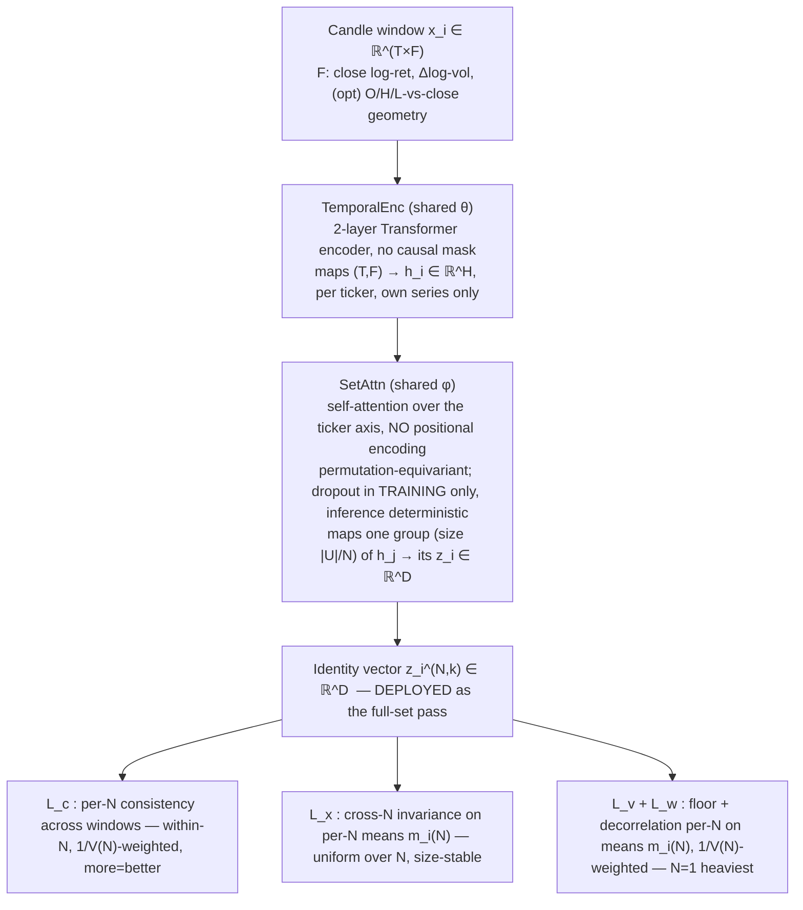
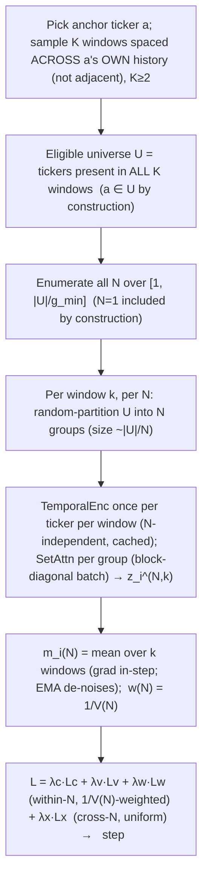

# Stock Identity — Inductive Self-Supervised Relational Embedding

## 1. Purpose

Train one encoder that, at inference, takes a **set** of ticker candle-windows and emits per ticker an **identity vector** `z_i ∈ ℝ^D` with these properties:

| Property | Meaning |
|---|---|
| distinct-in-set | `z_i` separable from other tickers' vectors in the same set |
| label-free | no external/target label anywhere in training |
| temporally consistent | same ticker → near-equal `z_i` across different time windows |
| relational | `z_i` derives from this ticker's relations to others in the set |
| inductive | encoder generalizes to tickers never seen in training |
| unique | competitors stay separated even when same-sector tickers cluster near |

Downstream consumer: a cross-stock situation-reporter module that attends over `{z_i}` as per-ticker identity tokens.

## 2. Method

**VICReg-style non-contrastive self-supervised learning over sets, with temporal positives.**
VICReg = Variance-Invariance-Covariance Regularization: prevents representation collapse with explicit variance + covariance penalties instead of negative samples. "Over sets" = the encoder is permutation-equivariant across the ticker axis (reordering the input tickers reorders the outputs identically; a ticker's output does not depend on its position). "Temporal positives" = the two views of a ticker being pulled together are two different **time windows**, not two augmentations of one image.

Contrastive (InfoNCE) was the alternative; rejected here because it needs many negatives + a temperature and makes the elimination shortcut (§8) more tempting. Non-contrastive preserves every invariant and removes those two knobs.

## 3. Notation

| Symbol | Meaning |
|---|---|
| `T` | window length (trading days) |
| `F` | input features per day (§4; F=2 core, 5 with candle geometry) |
| `U` | the window universe — all eligible tickers present that window (`|U| ≈ 348`) |
| `N` | number of groups `U` is partitioned into; group size ≈ `|U|/N`. **Low N = fewer, bigger groups = more peers; N=1 = the full set (deploy config).** **Enumerated** over `1 ≤ N ≤ |U|/g_min` every step (§7) |
| `g_min` | min group size (peers per group), ≈ 8 — caps `N` so every group carries relational signal (no singletons) |
| `V(N)` | expected within-N consistency variance (finite-population correction): `∝ (N−1)/(|U|−1) + v₀`; `v₀` = full-set non-sampling-noise floor; fit from §9 probe. Sets the **within-N precision weight `w(N) = (1/V(N)) / Σ_{N'} 1/V(N')`** (§6), shared across `L_c`/`L_v`/`L_w` |
| `w(N)` | normalized within-N precision weight `(1/V(N)) / Σ_{N'} 1/V(N')`; heaviest at `N=1` (`V(1)=v₀` smallest). Combines the within-N losses across the enumerated `N`; `L_x` (cross-N) does **not** use it |
| `K` | windows sampled per training step (`K ≥ 2`) |
| `H` | temporal-encoder hidden width |
| `D` | identity-vector dim (deployed), **`D=32`**. Kept small so `|U| ≫ D`: `L_w` and the §9 effective-rank probe estimate a `D×D` covariance from `|U|` ticker-samples, which goes rank-deficient / noise-inflated when `D ≈ |U|`. Treat as the *measured* effective rank, not a default — raise if §9 shows it pegged (§6 `L_w` note) |
| `z_i^{(N,k)}` | identity of ticker `i` in window `k` under an `N`-group partition |
| `m_i^{(N)}` | per-N mean: mean of `z_i^{(N,k)}` over the `K` windows at partition count `N` — **carries gradient in-step**; EMA across steps only de-noises (never a stop-grad target). The within-N losses `L_c`/`L_v`/`L_w` act on these |
| `z̄_i` | pooled per-ticker identity: within-N-weighted mean `Σ_N w(N)·m_i^{(N)}` — diagnostic only, **no longer a loss target** (losses act per-N). Deploy uses the `N=1` mean `m_i^{(1)}` specifically (§12) |
| `ID_i` | deployed static identity: mean over windows of the full-set pass (§12) |
| `λ_c,λ_x,λ_v,λ_w,λ_r` | loss weights (per-N consistency, cross-N invariance, variance, covariance, gated relational synergy §6) |
| `γ` | target per-dim std in the variance floor (≈ 1) |
| `sg(·)` | stop-gradient (treated as constant in backprop) |

## 4. Input representation (Fork A)

Per ticker per day, from raw OHLCV `(O,H,L,C,V)`:

| # | Channel | Formula | Note |
|---|---|---|---|
| 1 | close log-return | `log(C_t / C_{t-1})` | core |
| 2 | volume log-change | `log(V_t / V_{t-1})` | core; level-free volume |
| 3 | open geometry | `log(O_t / C_t)` | optional candle shape |
| 4 | high geometry | `log(H_t / C_t)` | optional candle shape |
| 5 | low geometry | `log(L_t / C_t)` | optional candle shape |

Then divide each channel `c` by **one global constant** `s_c` = std of channel `c` over all tickers' training rows (one scalar per channel, **not** per-ticker, no per-ticker centering).

Rationale (terse):
- Absolute price/volume **level** is stable per ticker but a trivial lookup → would make consistency free and defeat inductivity → removed by differencing.
- Global (not per-ticker) scaling fixes optimization scale **without** erasing volatility: a 2×-volatility ticker stays 2× after scaling, so volatility-magnitude survives as an identity signal.
- The 40+ engineered indicators are deliberately excluded — they pre-bake structure and bloat input. Optional add-on: append per-window realized volatility as a scalar side-feature; default off (raw log-returns already carry it).

## 5. Architecture



- **TemporalEnc**: 2-layer Transformer encoder. At `T=60`, Mamba's long-sequence advantage is moot and adds CUDA/triton install friction — use it only if `T` grows past ~500. SetAttn is the load-bearing relational part; spend complexity there.
- **SetAttn**: standard self-attention with **no positional encoding** on the set axis → permutation-equivariant and size-agnostic by construction; this is what lets the **N-sweep** (§7) train one encoder across all group sizes and makes the size-invariance `L_x` (§6) attainable. At `|U| ≈ 348` full `O(|U|²)` attention is cheap; switch to Set-Transformer induced points (ISAB) only if `|U|` grows large.
- **Dropout** = standard regularizer, active in training only. **Inference runs in eval mode → deterministic `z_i`** (a stable ID must not vary per forward pass, and there is no uncertainty-quantification consumer here — unlike the separate price predictor). Anti-elimination never depended on inference-time dropout; re-partitioning + the N-sweep + `L_c` (§8) carry it.

## 6. Losses

All gradients flow through the encoder; **no labels** enter anywhere. Each training step **enumerates every `N`** (number of groups; low N = bigger groups = more peers, §7); the loss combines three **within-N** terms (`L_c`/`L_v`/`L_w`, weighted across `N` by `w(N)=1/V(N)`, heaviest at `N=1`) with one **cross-N** term (`L_x`, uniform over `N`).

- **Per-N consistency** (temporal + neighbor invariance), on `z`, a **within-N** metric → combined across the enumerated `N` by **precision weight `w(N) = (1/V(N)) / Σ_{N'} 1/V(N')`** (normalized inverse-variance; `N=1` heaviest):
  `L_c = Σ_N w(N) · mean_i [ (1/K) · Σ_k ‖ z_i^{(N,k)} − m_i^{(N)} ‖² ]`
  Variance of ticker `i` across the `K` windows at partition count `N`, merged across `N` by precision. Drives **within-N precision**; "more = better" emerges because larger groups (lower `N`) genuinely lower this variance — toward `0` at `N=1` (the full set). Random re-partition each window → invariance to neighbor composition (`N=1` has no partition choice → trains the deploy config's pure cross-window consistency). The emphasis is now an **explicit deterministic `w(N)`, not a sampling frequency** (§7 enumerates every `N`): the old worry that a steep per-`N` multiplier "collapses onto whichever low-`N` is drawn" was an artifact of *sampling* — with every `N` present each step there is no draw to collapse onto, so the GLS-optimal `1/V(N)` emphasis applies directly.

- **Cross-N invariance** (size-invariance), on the **per-N means** `m_i^{(N)}`, the lone **cross-N** metric → **uniform over all enumerated `N` (no precision weight — the only free pass)**:
  `L_x = mean_i Var_N( m_i^{(N)} )`   (uniform over `N`)
  Pulls a ticker's identity together across group sizes → the ID does not depend on how many peers it was scored with. **Must stay uniform**: precision-weighting a cross-`N` *difference* would down-weight large `N` and stop measuring drift exactly at the small-group end — the regime furthest from the `N=1` deploy limit — silently un-enforcing size-invariance where it is needed most. Computed **on the means, not raw draws**: raw-draw tying would also equalize small- vs big-group *precision* and flatten "more = better"; mean-tying penalizes only genuine size-drift. `m_i^{(N)}` carries gradient in-step; EMA across steps only de-noises — **not** a stop-grad target (a fully detached `m` makes `Var_N(m)` gradient-free and `L_x` a no-op).

- **Variance floor** (anti-collapse), a **within-N** metric on the **per-N means** `m_i^{(N)}`, per dimension `d`, combined by `w(N)`:
  `L_v = Σ_N w(N) · mean_d max(0, γ − √( Var_i(m_{i,d}^{(N)}) + ε ))`  (`ε ≈ 1e-4`)
  Per `N`, the between-ticker variance of the (window-de-noised) per-N means; merged across `N` by precision so **`N=1` (the deployed config) is floored most heavily and directly** — its spread no longer depends on `L_x` dragging it into line with an all-`N` pool. The `ε` is the VICReg numerical guard — without it the gradient `∝ 1/√Var` diverges as a dimension collapses, exactly when the floor must push outward (and at init, where per-dim variance is tiny). On the **means** (not raw windows) so within-ticker noise cannot pad the floor — `m_i^{(N)}` averages over the `K` windows and the EMA de-noises further; **per-`N`** (not the all-`N` pool `z̄`) so the deployed slice is constrained where it ships. "No ticker like another at any `N`" now holds at each `N` directly, `N=1` most.

- **Covariance / decorrelation** (full-rank use), a **within-N** metric on the per-N means `m_i^{(N)}`, combined by `w(N)`:
  `L_w = Σ_N w(N) · (1/D) · Σ_{d≠d'} [ Cov_i(m^{(N)}) ]²_{d,d'}`
  Off-diagonal covariance → 0 → embedding uses its full capacity → sharper uniqueness. Per-`N` and `w(N)`-weighted for the same reason as `L_v`: the deployed `N=1` config is decorrelated directly, not transitively through `L_x`. **Small-sample caveat:** `Cov_i` is a `D×D` matrix estimated from `|U|` ticker-rows, so it is rank-deficient / noise-floored when `D ≈ |U|` — the off-diagonal floor of a *truly* decorrelated embedding is `≈ (D−1)/|U|`, and the same noise inflates the §9 effective-rank probe (so it can't detect dimensional collapse). The chosen **`D=32`** keeps `|U| ≫ D` (`|U|≈118` on the smallest deep-anchored steps, ~350 on recent ones → floor `≈ 0.26` / `0.09`, vs `≈1.08` at `D=128`), so this is mild and the probe stays honest. If the deep-step floor still bites, accumulate `Cov_i` over a multi-step pseudo-batch (`n_eff ≫ D`) — a contingency, not a default (don't add it preemptively).

- **Relational synergy** `L_r` (**gated** — on only if the §9 attention-concentration probe reads narrow; off by default). Forces peers to be *used* without dictating *which* relation. Three masked passes of SetAttn through the **same shared encoder** give ticker `i` three embeddings: `z_i^self` (`i` attends to itself only → own-series), `z_i^grp` (`i` attends to peers only → relational), `z_i^both` (normal — the deployed config). Quality is the across-window **precision** `p(z) = 1 / (Var_k(z) + ε)` (inverse variance over the `K` windows; higher = more consistent; `ε` the same guard as `L_v`). One **superadditivity** check, stop-gradient on the two reference passes:
  `L_r = mean_i relu( p(sg(z_i^self)) + p(sg(z_i^grp)) − p(z_i^both) )`
  Precisions **add under independent fusion** (two independent estimators of one identity combine to precision `p₁+p₂`), so `p(both) ≥ p(self) + p(grp)` demands the both-pass beat *independent fusion of the parts* — genuinely emergent, non-additive synergy, with "sum of parts" a **principled bar, not an arbitrary margin**. It blocks **both** shortcuts deductively: the own-series shortcut gives `p(both)=p(self)` ⟹ needs `p(grp) ≤ 0` (impossible, `p>0`); the peers-only shortcut gives `p(both)=p(grp)` ⟹ needs `p(self) ≤ 0` (impossible). The **stop-gradient `sg(·)`** on the parts removes the perverse path: without it the check is met by *degrading* `z^self`/`z^grp` (cheap — nothing else pins their precision, since `L_c`/`L_v`/`L_w` act only on the `both` pass) instead of *improving* `z^both`; with it the only gradient route is to raise `p(both)`, and clearing `p(self)+p(grp)` is unreachable without genuinely using the peers. No margin `m` — equality *is* the independent-fusion floor, any excess is emergence. Cost: 3× SetAttn passes; deployed config is `both`. Target-agnostic by design (uses the model's own consistency, not a chosen relation like correlation) — fits "any relation that works".
  *Caveats:* (i) `1/Var` over only `K=2–4` windows is spiky — compute `Var_k` on the EMA-de-noised per-N means (or over more windows) and clamp `p` to `[0, 1/ε]`. (ii) `p` is capped at `1/ε`, so when both parts are individually very consistent the bar `p(self)+p(grp)` can exceed any reachable `p(both)`; `L_r` then stays positive and merely pushes `p(both)` toward max consistency (aligned with `L_c`) — so read health off the logged `p(self)`/`p(grp)`/`p(both)`, not off `L_r=0`.

**Within-N vs cross-N — the one weighting rule.** Three of the four core terms are **within-N** (measured at a fixed group-count: consistency `L_c`, between-ticker spread `L_v`, decorrelation `L_w`). By the size-invariance premise each estimates *the same* quantity at `N`-dependent precision, so each is combined across `N` by inverse-variance `w(N)=1/V(N)` (heaviest at `N=1`, the deploy config). `L_x` is the only **cross-N** term — it measures *drift across* `N` — so it alone takes a uniform free pass; weighting it would un-measure the very drift it exists to catch (and re-introduce the small-group blind spot). `V(N)` was derived as the *consistency* precision (§3); reused as the shared within-N weight it is an approximation — the precision *profile* (more peers → tighter per-N means → more honest spread/decorrelation estimate) is shared in shape across the three within-N terms, though the exact constant may differ per term.

Total: `L = λ_c·L_c + λ_x·L_x + λ_v·L_v + λ_w·L_w`  (`+ λ_r·L_r` when gated on).

All terms act in `z`-space — `L_v`/`L_w` on the per-N means `m_i^{(N)}`, `L_c` on the per-window embeddings `z_i^{(N,k)}`, `L_x` on the per-N means across `N`. The floor sits in the same space the consistency/invariance pulls would shrink: a global contraction that cheapens `L_c`/`L_x` immediately violates `std_i(m_{i,d}^{(N)}) ≥ γ` at every `N` (heaviest at `N=1`), so the floor anchors the embedding scale at the deployed config directly.

Property → enforcing mechanism:

| Property | Enforced by |
|---|---|
| distinct-in-set | `L_v`, `L_w`, SetAttn |
| label-free | scheme has no labels |
| temporally consistent | `L_c` |
| relational | SetAttn + `L_v` on own-series-**confusable** pairs (forces peer-use; measured, §9) |
| inductive / size-invariant | shared weights + `L_x` + held-out-ticker eval |
| unique | `L_v` + `L_w` |

Starting weights (tune): `λ_c=25, λ_x=10, λ_v=25, λ_w=1` (gated relational: `λ_r≈1`, no margin — the bar is the parts' summed precision). Defaults: `T=60, H=128, D=32, K=2–4, γ=1`, `g_min≈8` (`D=32 ≪ |U|` keeps the `L_w` covariance / §9 effective-rank well-conditioned — see §6 `L_w` note; `H` stays 128, it is independent of `D`). Per step: **enumerate every `N ∈ [1, |U|/g_min]`** (`N=1` included by construction); combine within-N terms (`L_c`/`L_v`/`L_w`) by `w(N)=(1/V(N))/Σ_{N'}1/V(N')`, keep `L_x` uniform over `N`; `V(N) ∝ (N−1)/(|U|−1) + v₀` (finite-population correction — `|U|` baked in, `0` sampling-noise at `N=1`), `v₀` fit from the §9 more=better probe. Enumeration is cheap: TemporalEnc is `N`-independent (encode each ticker once per window, reuse for all `N`); only SetAttn repeats, summing to `≈ ln(|U|/g_min)·|U|²` — a few× one full-set pass — and the per-`N` groups batch into one block-diagonal-masked SetAttn call.

## 7. Training step



```python
def step():
    a = sample_anchor_ticker()                           # uniform (or weighted toward under-covered tickers)
    W = sample_K_windows_spread_within_history(a)        # K >= 2, spaced as wide as a's OWN history allows
    U = tickers_present_in_all(W)                        # present-in-all-K (predicate UNCHANGED); a in U by construction
    h = {k: {i: TemporalEnc(features(win, i)) for i in U}   # N-INDEPENDENT: encode each ticker
         for k, win in enumerate(W)}                        #   once per window, reuse for every N
    z = nested_dict()                                    # z[N][k][i]
    for N in range(1, len(U)//g_min + 1):                # ENUMERATE all N every step (N = 1 .. |U|/g_min)
        for k in range(len(W)):
            for grp in random_partition(U, n_groups=N):  # re-partition each window
                z[N][k].update(zip(grp, SetAttn([h[k][i] for i in grp])))  # block-diagonal batchable; dropout on
    m  = {N: {i: mean_k(z[N][k][i]) for i in U} for N in z}   # per-N means over K windows (carry grad; EMA de-noise across steps)
    wN = {N: 1.0/V(N) for N in z};  Z = sum(wN.values())     # within-N precision weights, N=1 heaviest
    Mn = lambda N: stack([m[N][i] for i in U])               # (|U|, D) matrix of per-N means
    # within-N terms: weighted by wN[N]/Z  (N=1 heaviest = the deploy config)
    Lc = sum(wN[N]*mean_i(var_k(z[N][k][i])) for N in z) / Z
    Lv = sum(wN[N]*mean_d(relu(gamma - sqrt(var_batch(Mn(N)[:, d]) + eps))) for N in z) / Z
    Lw = sum(wN[N]*offdiag_sq_sum(cov_batch(Mn(N)))/D for N in z) / Z
    # cross-N term: UNIFORM over N (the lone free pass) — full-range coverage
    Lx = mean_i(var_N(m[N][i] for N in z))
    (lam_c*Lc + lam_x*Lx + lam_v*Lv + lam_w*Lw).backward()
    opt.step()
```

Step rules that matter:
- **Ticker-anchored windows, spread as wide as the anchor's history allows; not adjacent.** Each step picks an anchor ticker `a` (uniform, or weighted toward under-covered tickers) and draws the `K` windows spaced across **`a`'s own** history. Adjacent windows share near-identical content → trivial consistency; spread windows force identity to survive regime change — but the spread is **feasibility-relative** (a 2011 survivor → decade-wide spread; a 2024 IPO → ~2-year spread), not a fixed calendar gap. This is what **guarantees coverage**: every ticker with ≥2 spaceable windows is anchored with positive probability, so it appears in training. A fixed *global* far-spread window set would instead intersect (e.g.) a 2012 window with a 2024 one and leave only ~118/348 long-lived survivors — excluding the ~230 mostly-2021+-IPO names, who would then be out-of-distribution at deploy yet **not** flagged (`σ_i` measures within-ticker resolution, not distance from the training regime).
- **Enumerate `N`, re-partition every window.** Compute every `N ∈ [1, |U|/g_min]` each step (`N=1` = full set = deploy config, included by construction; cap at group size `g_min` — singleton groups carry no relational signal). Random partitions at `N>1` are the anti-elimination pressure; `N=1` has no partition choice. Enumeration is cheap because the dominant cost, TemporalEnc, is `N`-independent and computed once per ticker per window; only the cheap SetAttn repeats (harmonic sum `≈ ln(|U|/g_min)·|U|²`, batchable into one block-diagonal-masked SetAttn call). The old "sample a few `N`, cover the range over steps" scheme was a cost dodge that mis-assumed a per-`N` re-encode; it also coupled coverage to emphasis and starved `L_x` at large `N` — enumeration removes both.
- **Emphasis = explicit per-loss-class weight, not sampling frequency.** Within-N terms (`L_c`/`L_v`/`L_w`) combine across `N` by `w(N)=(1/V(N))/Σ_{N'}1/V(N')` — inverse-variance / GLS-optimal merging of same-quantity estimators of differing precision, heaviest at `N=1`. The cross-N term `L_x` stays **uniform** (weighting a cross-`N` difference un-measures size-drift at large `N`). Because every `N` is computed every step these are deterministic weights, so the old "steep multiplier collapses onto the drawn low-`N`" failure (a sampling artifact) cannot arise. `V(N) ∝ (N−1)/(|U|−1) + v₀` (finite-population-corrected; `|U|` baked in, `0` sampling-noise at `N=1`, floored by `v₀`), fit from the §9 more=better probe; expect extra steepening toward `N=1` if relational structure dominates (Marchenko–Pastur).
- **Eligible `U` = present in all `K` windows** (predicate **unchanged**) so the per-N cross-window variance `L_c` is computable for every ticker; the anchor `a ∈ U` by construction. Tickers with <2 spaceable windows genuinely have no cross-window pair → they cannot enter `L_c` and stay **deploy-flag-only** (§12, `σ_i` undefined), correctly left out of training rather than forced in.

## 8. Why it does not degenerate

| Degenerate solution | Guard |
|---|---|
| full collapse (all `z` equal) | `L_v` per-dim std floor |
| dimensional collapse (spread in 1–2 dims) | `L_w` decorrelation |
| trivial consistency via price/volume level | level-free inputs (§4) |
| elimination shortcut ("I'm the odd one out in this group") | random re-partition + N-sweep → no fixed peer set to exploit; `L_c` across different neighbor sets |
| memorize a narrow set of specific peers | `L_x` cross-N invariance: a composition/size-dependent feature is not N-invariant → penalized |
| own-series shortcut (ignore peers entirely → trivially consistent, non-relational) | **not** loss-blocked by invariance terms (peer-independence games them all); `L_v` on own-series-**confusable** pairs forces peer-use to separate them; strength = how many such pairs exist → **measured** by the attention-concentration probe (§9), not assumed |

Two narrow failures, two guards: *memorize specific peers* is killed by `L_x` (size/composition-dependence ⇒ penalized); *ignore all peers* is reached only as far as own-series features can discriminate, and `L_v` forces relations wherever own-series can't separate two tickers. The residual — does the encoder aggregate broadly — is **measured** (attention concentration / peer-swap sensitivity, §9), with the gated relational-synergy term `L_r` (§6) as the lever if the probe reads narrow.

## 9. Evaluation probes

| Probe | Measures | Pass condition |
|---|---|---|
| discriminability ratio = between-ticker var / within-ticker across-window var, **plus the absolute between-ticker spread** (mean pairwise `‖z̄_i − z̄_j‖`, **eval-mode / dropout-off**) | core health (the eval-mode spread also catches the dropout train/eval gap) | ratio `> 1` **and** absolute spread holds at the floor `γ`. **Not "rising"**: `L_c` drives the denominator → 0, so a climbing ratio is near-automatic and the scale-invariant ratio can mask an *eroding* numerator — watch the numerator / absolute spread, not the climb |
| same ratio on **held-out tickers + held-out time**, **stratified by history length (include a short-history / recent-IPO slice)** | inductivity — incl. the young-ticker regime, not just survivors | comparable **across history-length buckets**, not only on long-history tickers |
| cross-N drift: `m_i(N)` across partition counts `N` | size-invariance (`L_x`) | small mean-drift |
| more=better slope: within-N variance vs group size | peers actually help | variance falls as groups grow |
| attention concentration / peer-swap sensitivity | actually relational (not own-series, not memorized) | attention spread over many peers; `z_i` tracks peer *structure*, stable to peer *identity* |
| effective rank (participation ratio of `cov(z̄)`) — trustworthy now that `D=32 ≪ |U|` | full-rank use **+ validates `D`** | high (`≈ D`); but if **pegged at `D` while discriminability is only adequate**, `D` is capping identity → raise it. Confirm capacity with a `D=32` vs `D=64` A/B (if 64 uses >32 effective dims *and* separates better, 32 was too tight) |
| sector kNN purity vs known peers (eval-only labels) | close-but-distinct | high purity, non-zero pairwise distance |

The attention-concentration row **gates `L_r`** (§6): a narrow reading (attention on few peers, `z_i` insensitive to peer swaps) turns the relational-synergy term on; otherwise leave it off. The more=better row **fits `V(N)`** (§7): its within-N-variance-vs-group-size curve yields `v₀` and any curvature, which set the within-N loss weights `w(N) ∝ 1/V(N)` (§6).

## 10. Caveats

- **Rotation identifiability.** Variance/covariance losses are invariant to orthogonal transforms → the embedding is defined only up to an isometry. Two separately-trained encoders produce **non-comparable** vectors. Train once, **freeze**, reuse.
- **Causal windows downstream.** When `z_i` feeds a predictor at time `t`, build its window from candles `≤ t` only — no lookahead leak. SSL **training** windows may sit anywhere in history.
- **Freeze for the consumer.** The cross-stock reporter consumes frozen `z` as fixed per-ticker identity tokens; do not co-train it against a moving encoder unless intentionally fine-tuning end-to-end.

## 11. Downstream hook

Inference (eval mode, deterministic). Each ticker's identity token is its frozen static `ID_i` (§12). The reporter attends over `{ID_i}` for the tickers in scope, combined with the current decision window's dynamics, to produce cross-stock situation features for the target ticker. Set size is unconstrained by construction (SetAttn + `L_x` size-invariance).

## 12. Deploying the ID (static, per-window mean)

Premise: identity is stationary → each window's inference is a noisy observation of one fixed `μ_i`; averaging over windows reduces that noise (variance reduction, not time-blending). Per-window scope is **not** fixed — it is whatever tickers are present that window — so comparability/averageability rests on **`L_x` (cross-N invariance, §6)** making `z` approximately independent of group size, **not** on the scope being constant. Freeze the mean as `ID_i`, reuse.

Procedure:
1. Tile history into windows spaced by stride ≥ `T` → near-independent samples. Overlapping windows are near-duplicate draws: they pad the count without tightening the mean. "Resolution" = the number of *independent* windows a ticker appears in.
2. Per window `w`: one eval-mode (deterministic) pass over **the full present set** (`N=1` — the largest scope, most peers, most precise) → one `z_i^{(w)}` per ticker. `L_x` makes the size choice safe; **no small groups, no covering** at inference.
3. Per ticker: `ID_i = mean_w z_i^{(w)}` over the windows where `i` appears, equal weight (no recency tilt — stationary-sample premise). Freeze → deployed artifact.
4. Coverage varies → resolution varies (short-history tickers get fewer samples; acceptable, not critical). `σ_i = std_w( z_i^{(w)} )` = per-ticker resolution / stability readout: high → identity in flux or under-sampled, consumer may downweight. (Single-window ticker → no average, `σ_i` undefined → flag low-confidence.)

Do **not** report a `σ/√(#windows)` standard error: the per-window samples are not iid (overlapping windows, drifting present-set), so a calibrated SE would overstate confidence — `σ_i` is the honest resolution signal.

Train/deploy scope match: deployment scores the full set (`N=1`); training **enumerates `N=1` every step** alongside all larger `N`, and the within-N losses weight `N=1` heaviest (`w(1)` largest, since `V(1)=v₀` is smallest). So the deployed config's consistency, spread, and decorrelation are trained **directly at `N=1`**, not reached by extrapolation — `L_x` additionally ties `N=1` to larger-group scopes for size-invariance, but is no longer the sole guarantor of the deploy slice's quality. No universe branch, no covering, no small-group inference. Residual: if cross-`N` drift is still visible at deploy (§9 probe, stratified by group size), raise `λ_x`.

Point-in-time discipline: a full-history `ID_i` has seen data after any past date, and stationary-by-intent does **not** make it causal — lookahead features can still hide in the estimate (it is a function of the averaged windows, post-date ones included). So full-history IDs are for **non-decision use only** (offline clustering, viz).

**Integration contract (deferred — not wired now):** when `ID_i` feeds the main prediction model, it is built from a window set with **no candles after that model's as-of point** — bounded by the model's *training* cutoff while training, by the *inference* date while scoring. One frozen ID-set per cutoff, reused across the period (not per day); applies to every path into the prediction model, the situation reporter included.

**Encoder-fitting scope — accepted by design; NOT a leak to flag.** The contract above bounds the *input windows* (`≤ as-of`), **not** the encoder weights `θ`/`φ` or the channel scalers `s_c`, which are fit **once on all history** and frozen (§10). This is **intentional and accepted**, for one reason: this encoder's deliverable is **information encoding, not prediction**. Its validity is established **intrinsically** — training loss plus the §9 held-out-**ticker** discriminability/consistency probes — a path that never touches a forward-return target. The *only* residue of full-history fitting is that a **downstream** point-in-time backtest of the prediction model reads **mildly optimistic**, and that residue is (i) **covariate, not label** — the SSL encoder never sees returns; (ii) **bounded by the stationarity premise** — stationary identity ⇒ a future-trained vs cutoff-trained encoder yield ≈ the same `z` ⇒ leak → 0 (and if identity were non-stationary enough to matter, the deploy-averaging premise above would break first); (iii) dominated by the weights — `s_c` is one global scalar per channel, negligible. **Therefore:** treat downstream backtest numbers as upper bounds, do not conflate them with the encoder's intrinsic validity, and do **not** "fix" this (e.g. per-fold cutoff encoders) unless a strictly leak-free point-in-time backtest is *explicitly* required. Sole guardrail: never tune the encoder *against* the downstream backtest — that would turn bounded reporting-optimism into a selection feedback loop. (A validation pass that re-raises this as a defect has missed the encoding-vs-prediction distinction stated here.)

(Second-order: a past window's present-set holds only survivors-to-today → mild survivorship tint in the relational context; ignore unless exact historical conditioning is needed.)
