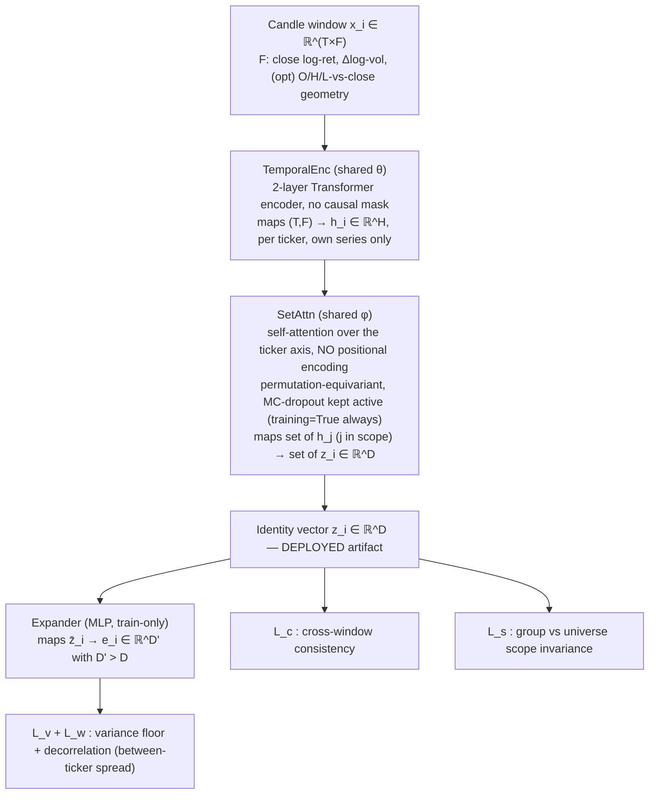
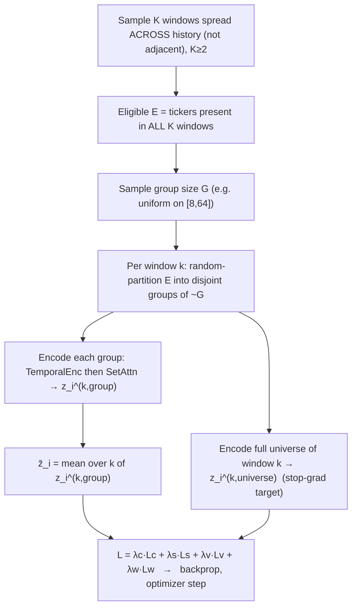

# Stock Identity — Inductive Self-Supervised Relational Embedding

## 1. Purpose

Train one encoder that, at inference, takes a **set** of ticker candle-windows and emits per ticker an **identity vector** `z_i ∈ ℝ^D` with these properties:

| Property | Meaning |
|---|---|
| distinct-in-set | `z_i` separable from other tickers' vectors in the same set |
| label-free | no external/target label anywhere in training |
| temporally consistent | same ticker → near-equal `z_i` across different time windows |
| relational | `z_i` derives from this ticker's relations to others in the set |
| inductive | encoder generalizes to tickers never seen in training |
| unique | competitors stay separated even when same-sector tickers cluster near |

Downstream consumer: a cross-stock situation-reporter module that attends over `{z_i}` as per-ticker identity tokens.

## 2. Method

**VICReg-style non-contrastive self-supervised learning over sets, with temporal positives.**
VICReg = Variance-Invariance-Covariance Regularization: prevents representation collapse with explicit variance + covariance penalties instead of negative samples. "Over sets" = the encoder is permutation-equivariant across the ticker axis (reordering the input tickers reorders the outputs identically; a ticker's output does not depend on its position). "Temporal positives" = the two views of a ticker being pulled together are two different **time windows**, not two augmentations of one image.

Contrastive (InfoNCE) was the alternative; rejected here because it needs many negatives + a temperature and makes the elimination shortcut (§8) more tempting. Non-contrastive preserves every invariant and removes those two knobs.

## 3. Notation

| Symbol | Meaning |
|---|---|
| `T` | window length (trading days) |
| `F` | input features per day (§4; F=2 core, 5 with candle geometry) |
| `N` | tickers in a scope (variable) |
| `G` | random group size, sampled per step |
| `K` | windows sampled per training step (`K ≥ 2`) |
| `H` | temporal-encoder hidden width |
| `D` | identity-vector dim (deployed) |
| `D'` | expander width (train-only), `D' > D` |
| `z_i^{(k)}` | identity of ticker `i` computed in window `k` |
| `z̄_i` | mean of `z_i^{(k)}` over the `K` windows in a step |
| `e_i` | `Expander(z̄_i) ∈ ℝ^{D'}` |
| `λ_c,λ_s,λ_v,λ_w` | loss weights (consistency, scope, variance, covariance) |
| `γ` | target per-dim std in the variance floor (≈ 1) |
| `sg(·)` | stop-gradient (treated as constant in backprop) |
| scope | a set encoded together: a random **group** (size `G`) or the window **universe** (all present tickers) |

## 4. Input representation (Fork A)

Per ticker per day, from raw OHLCV `(O,H,L,C,V)`:

| # | Channel | Formula | Note |
|---|---|---|---|
| 1 | close log-return | `log(C_t / C_{t-1})` | core |
| 2 | volume log-change | `log(V_t / V_{t-1})` | core; level-free volume |
| 3 | open geometry | `log(O_t / C_t)` | optional candle shape |
| 4 | high geometry | `log(H_t / C_t)` | optional candle shape |
| 5 | low geometry | `log(L_t / C_t)` | optional candle shape |

Then divide each channel `c` by **one global constant** `s_c` = std of channel `c` over all tickers' training rows (one scalar per channel, **not** per-ticker, no per-ticker centering).

Rationale (terse):
- Absolute price/volume **level** is stable per ticker but a trivial lookup → would make consistency free and defeat inductivity → removed by differencing.
- Global (not per-ticker) scaling fixes optimization scale **without** erasing volatility: a 2×-volatility ticker stays 2× after scaling, so volatility-magnitude survives as an identity signal.
- The 40+ engineered indicators are deliberately excluded — they pre-bake structure and bloat input. Optional add-on: append per-window realized volatility as a scalar side-feature; default off (raw log-returns already carry it).

## 5. Architecture



- **TemporalEnc**: 2-layer Transformer encoder. At `T=60`, Mamba's long-sequence advantage is moot and adds CUDA/triton install friction — use it only if `T` grows past ~500. SetAttn is the load-bearing relational part; spend complexity there.
- **SetAttn**: standard self-attention with **no positional encoding** on the set axis → permutation-equivariant and size-agnostic by construction; this is what makes scope-invariance (§6, `L_s`) attainable. At `N ≈ 348` full `O(N²)` attention is cheap; switch to Set-Transformer induced points (ISAB) only if `N` grows large.
- **MC dropout** = dropout left active at inference; here active in every pass so SetAttn cannot exactly pin down which neighbors are present.
- **Expander**: VICReg trick — apply variance/covariance terms in a wider space, deploy the narrower backbone `z`. Optional: drop it and compute `L_v,L_w` directly on `z` (one-line simplification).

## 6. Losses

All gradients flow through the encoder; **no labels** enter anywhere.

- **Consistency** (temporal + neighbor invariance), on deployed `z`:
  `L_c = mean_i [ (1/K) · Σ_k ‖ z_i^{(k)} − z̄_i ‖² ]`
  Same ticker across `K` windows, each with a different random group → `z_i` must be invariant to both time slice and neighbor composition.

- **Scope invariance** (set-size invariance), on deployed `z`:
  `L_s = mean_{i,k} ‖ z_i^{(k),group} − sg( z_i^{(k),universe} ) ‖²`
  `z^{group}` from a size-`G` random group; `z^{universe}` from all tickers present in window `k`; `sg` makes the universe pass a fixed target. Ties small-set and full-market embeddings → inductive / size-agnostic.

- **Variance floor** (anti-collapse), on expander `e`, per dimension `d`:
  `L_v = mean_d max(0, γ − std_i(e_{i,d}))`
  `std_i` over the batch of per-ticker `e_i`. Forces each dimension to carry spread → no collapse to a point.

- **Covariance / decorrelation** (full-rank use), on expander `e`:
  `L_w = (1/D') · Σ_{d≠d'} [ Cov_i(e) ]²_{d,d'}`
  Pushes off-diagonal covariance to zero → embedding uses its full capacity → sharper uniqueness.

Total: `L = λ_c·L_c + λ_s·L_s + λ_v·L_v + λ_w·L_w`.

`L_v` and `L_w` operate on **per-ticker means** `z̄_i` → they are literally the between-ticker variance/covariance (anti-collapse), kept orthogonal to `L_c` (within-ticker, across-window).

Property → enforcing mechanism:

| Property | Enforced by |
|---|---|
| distinct-in-set | `L_v`, `L_w`, SetAttn |
| label-free | scheme has no labels |
| temporally consistent | `L_c` |
| relational | SetAttn (architecture) |
| inductive | shared weights + `L_s` + held-out-ticker eval |
| unique | `L_v` + `L_w` |

Starting weights (VICReg-derived, tune): `λ_c=25, λ_s=10, λ_v=25, λ_w=1`. Defaults: `T=60, H=128, D=128, D'=512, K=2–4, G~U[8,64], γ=1`.

## 7. Training step



```python
def step():
    W = sample_K_windows_spread_across_history()       # K >= 2
    E = tickers_present_in_all(W)                       # eligible set
    G = sample_group_size()                             # e.g. U[8, 64]
    zg = {}                                             # zg[k][i] group embedding
    zu = {}                                             # zu[k][i] universe embedding
    for k, w in enumerate(W):
        for grp in random_partition(E, size=G):         # re-partition each window
            h = TemporalEnc(features(w, grp))           # (|grp|, T, F) -> (|grp|, H)
            zg[k].update(zip(grp, SetAttn(h)))          # -> (|grp|, D), MC-dropout on
        hu = TemporalEnc(features(w, present(w)))       # full universe of window w
        zu[k] = read_off(SetAttn(hu), E)
    zbar = {i: mean_k(zg[k][i]) for i in E}
    Lc = mean_i(var_k(zg[k][i]))
    Ls = mean_ki(sqdist(zg[k][i], stop_grad(zu[k][i])))
    e  = Expander(stack([zbar[i] for i in E]))          # -> (|E|, D')
    Lv = mean_d(relu(gamma - std_batch(e[:, d])))
    Lw = offdiag_sq_mean(cov_batch(e))
    (lam_c*Lc + lam_s*Ls + lam_v*Lv + lam_w*Lw).backward()
    opt.step()
```

Sampling rules that matter:
- **Windows spread across history**, not adjacent. Adjacent windows share near-identical price content → consistency becomes trivial and teaches nothing; spread windows force identity to survive regime change.
- **Variable `G` + re-partition every window** is the primary anti-elimination pressure (§8), stronger than MC dropout.
- **Eligible = present in all `K` windows** so the cross-window variance `L_c` is computable for every batch member.

## 8. Why it does not degenerate

| Degenerate solution | Guard |
|---|---|
| full collapse (all `z` equal) | `L_v` per-dim std floor |
| dimensional collapse (spread in 1–2 dims) | `L_w` decorrelation |
| trivial consistency via price/volume level | level-free inputs (§4) |
| elimination shortcut ("I'm the odd one out in this group") | re-partition each window + variable `G` + `L_c` across different neighbor sets; MC dropout secondary |
| scope shortcut (ignore the set → `L_s` trivially satisfied → non-relational) | **not** loss-blocked; detect via relationality-ablation probe (§9); lever = lower `λ_s` / widen `G` |

Note on `L_s` ↔ relational tension: a market-structural relation (e.g. a ticker's loading on the market factor) is estimable from any representative subset, so it is *already* scope-invariant — `L_s` therefore **selects** structural relations over specific-neighbor ones, which is what a stable ID wants. The only failure mode is the model abandoning relations entirely; that is observable, not assumed (§9).

## 9. Evaluation probes

| Probe | Measures | Pass condition |
|---|---|---|
| discriminability ratio = between-ticker var / within-ticker across-window var | core health | `> 1` and rising |
| same ratio on **held-out tickers + held-out time** | inductivity | comparable to train tickers |
| scope drift: embed `i` in sets of size `{4,16,64,all}` | size-invariance | small drift of `z_i` |
| relationality ablation: `z_i` in-context vs `i`-alone | actually relational | moves, and consistently per ticker |
| effective rank (participation ratio of `cov(z)`) | full-rank use | `≈ D` |
| sector kNN purity vs known peers (eval-only labels) | close-but-distinct | high purity, non-zero pairwise distance |

## 10. Caveats

- **Rotation identifiability.** Variance/covariance losses are invariant to orthogonal transforms → the embedding is defined only up to an isometry. Two separately-trained encoders produce **non-comparable** vectors. Train once, **freeze**, reuse.
- **Causal windows downstream.** When `z_i` feeds a predictor at time `t`, build its window from candles `≤ t` only — no lookahead leak. SSL **training** windows may sit anywhere in history.
- **Freeze for the consumer.** The cross-stock reporter consumes frozen `z` as fixed per-ticker identity tokens; do not co-train it against a moving encoder unless intentionally fine-tuning end-to-end.

## 11. Downstream hook

Inference: feed any-size set of causal candle-windows → `{z_i}`. The reporter attends over `{z_i}` (identity tokens) plus the current window to produce cross-stock situation features for the target ticker. Set size is unconstrained by construction (SetAttn + `L_s`).
